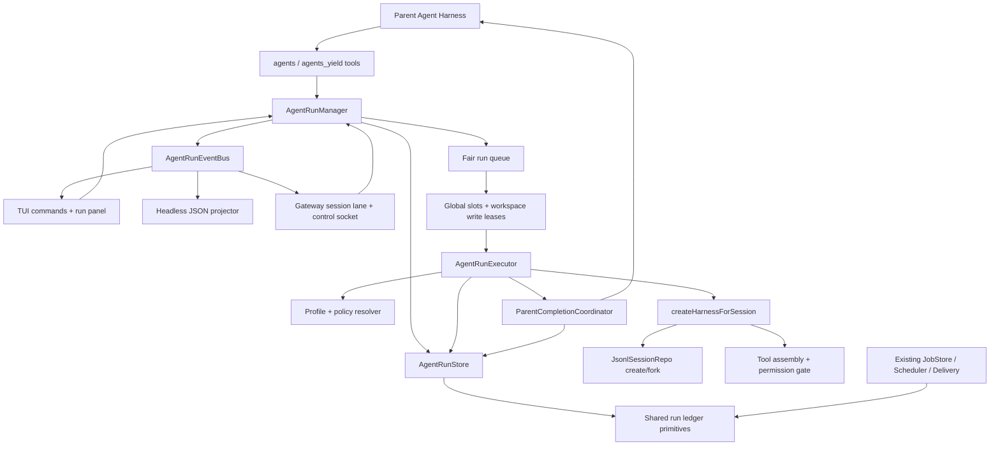
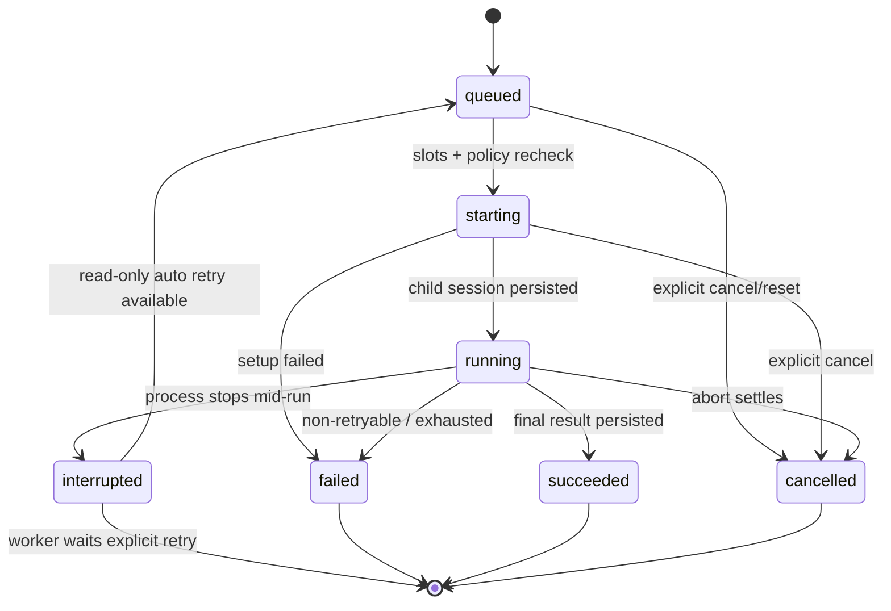
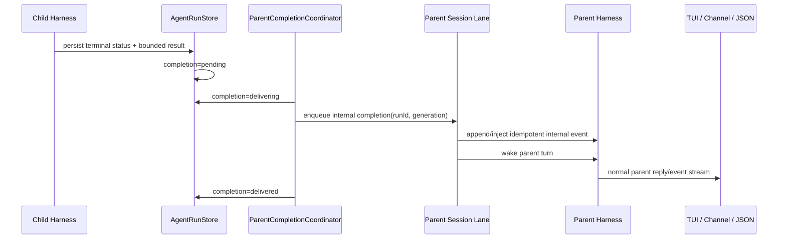
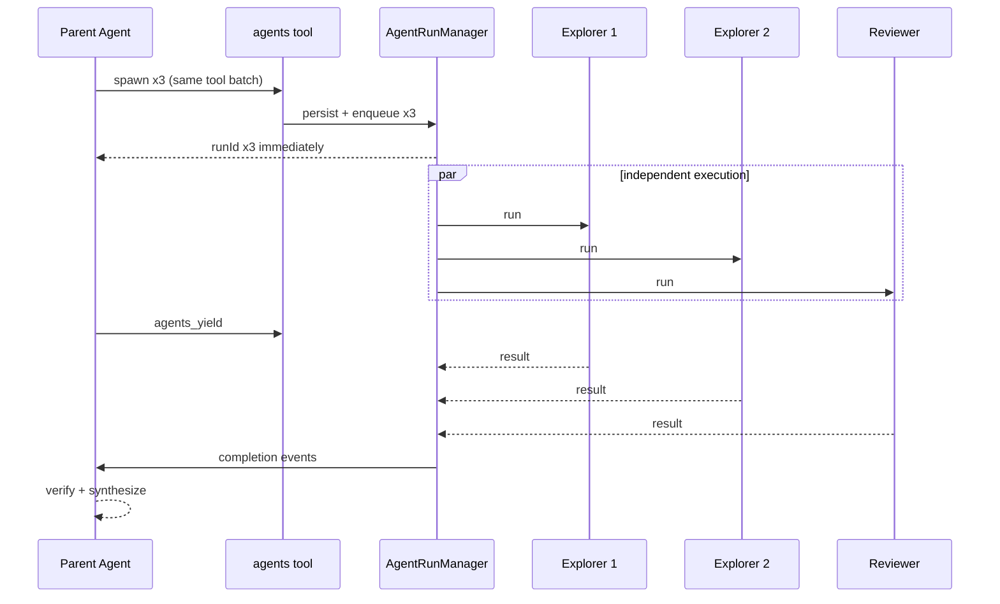
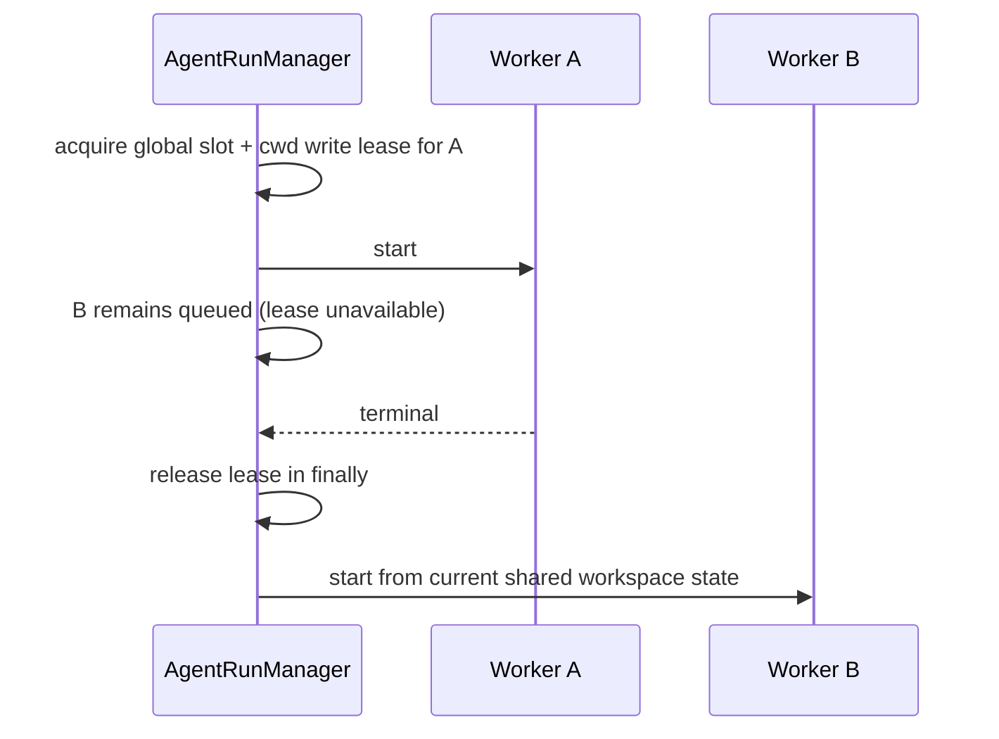
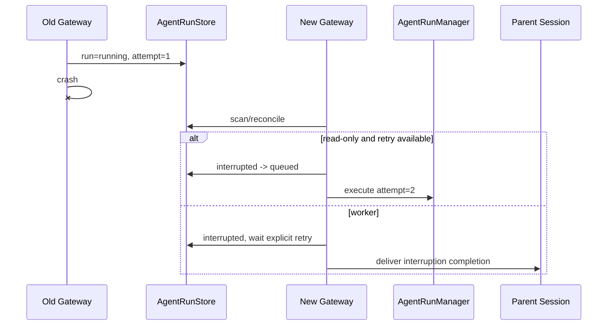
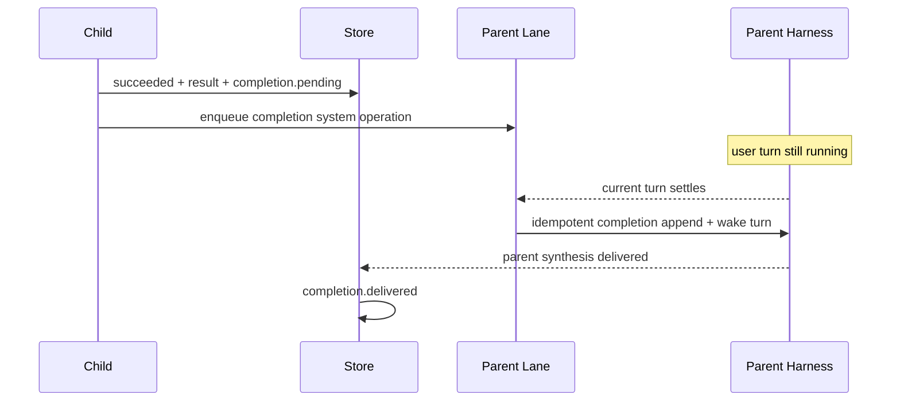

# 子代理与后台任务系统设计

## 1. 设计目标

Novi 需要增加的是一套可被 TUI、Headless 和 Gateway 共用的 **Agent Run Runtime**，而不是第二个聊天 session manager，也不是把立即委派伪装成 cron job。

系统必须同时满足：

- 父 Agent 能立即、非阻塞地委派独立工作；
- 至少三个子代理可真正并行，超出资源上限时可靠排队；
- 子代理拥有独立 transcript、profile、权限和预算；
- 运行状态与完成结果可持久化，进程重启后不谎称恢复内存调用栈；
- completion 先落盘，再由父 Agent 汇总并通过原有表面回复用户；
- scheduled jobs 保持兼容，并复用相同的底层运行合同而非形成两套重试/投递实现。

一句话边界：**Agent Run Runtime 负责“现在执行谁”；scheduled jobs 负责“什么时候触发”；父会话负责“如何对用户说”。**

## 2. 运行语义

| 类型 | 创建入口 | 是否独立上下文 | 是否阻塞父 turn | 持久化 | 重启行为 | 用户可见回复所有者 |
| --- | --- | --- | --- | --- | --- | --- |
| Foreground turn | 用户消息 / prompt | 否 | 本身就是父 turn | 父 JSONL | 由现有 session resume | 父 Agent |
| Ephemeral subagent | `agents.spawn` | 是 | 否 | run ledger + 子 JSONL | running → interrupted | 父 Agent |
| Background agent run | 与 subagent 相同；`notify` 控制 completion | 是 | 否 | run ledger + 子 JSONL + completion | queued 保留；running 中断后按 profile 重试 | 父 Agent |
| Scheduled job | `jobs` / `/jobs` | 是 | 不适用 | job definition + ScheduledRun | 现有 reconcile/retry | job delivery + origin 父 Agent |

“ephemeral subagent”与“background agent run”共用同一个 `AgentRun` 数据模型。差异只是父 Agent 是否在当前任务中等待 completion，以及 `notify` 是否自动唤醒父会话；不创建两套执行器。

## 3. 总体架构



### 3.1 模块边界

建议新增平台中立目录 `src/agents/`：

| 模块 | 职责 |
| --- | --- |
| `types.ts` | `AgentRun`、profile、状态、错误与事件合同 |
| `config.ts` | 解析 `settings.subagents`，执行 global/project tighten-only 合并 |
| `profiles.ts` | 内置 profile、自定义 profile、模型/工具/Skills/MCP/权限交集 |
| `store.ts` | 版本化 run 文件、原子创建/更新、扫描、retention、reconcile |
| `queue.ts` | FIFO 公平队列、全局 slot、单父活动数和 workspace write lease |
| `executor.ts` | 创建/订阅/关闭 child harness，统计 usage，分类错误 |
| `manager.ts` | spawn/list/get/cancel/retry、级联、恢复、调度和生命周期 |
| `events.ts` | 单一 `AgentRunEvent` 事件源，供三个表面投影 |
| `completion.ts` | completion 持久化与父会话 handoff 状态机 |
| `tool.ts` | 模型可见 `agents` 与 `agents_yield` descriptor |
| `format.ts` | TUI、Gateway、control socket 共用的安全摘要 |

建议新增 `src/runs/` 保存 scheduled jobs 与 agent runs 共用的底层合同：

- `errors.ts`：有界错误、retryable 分类；
- `atomic-file.ts`：`0600` temp + rename 与 `wx` 独占创建；
- `execution.ts`：attempt、usage、result 截断和状态转换辅助；
- `delivery.ts`：pending/delivering/delivered/ambiguous 的通用字段与幂等辅助。

现有 `src/gateway/jobs/` 保留 schedule、job ownership、cron cursor、heartbeat 和 channel delivery。首版只把可证明等价的底层代码抽到 `src/runs/`，不迁移现有 `$NOVI_HOME/jobs` 文件，也不改变 `ScheduledJob` / `ScheduledRun` 的版本 1 序列化形状。

## 4. 核心数据合同

### 4.1 `AgentRun`

```ts
type AgentRunStatus =
  | "queued"
  | "starting"
  | "running"
  | "succeeded"
  | "failed"
  | "interrupted"
  | "cancelled";

type AgentCompletionStatus =
  | "not_required"
  | "pending"
  | "delivering"
  | "delivered"
  | "suppressed"
  | "delivery_failed";

interface ParentSessionRef {
  surface: "tui" | "json" | "gateway";
  session: JsonlSessionMetadata;
  generation: string;
  route?: GatewaySessionRoute;
}

interface AgentRun {
  version: 1;
  id: string;
  taskName?: string;
  label?: string;
  task: string;

  parent: ParentSessionRef;
  parentRunId?: string;
  rootRunId: string;
  depth: number;
  retryOf?: string;

  profile: string;
  contextMode: "isolated" | "fork";
  workspace: { cwd: string; mode: "shared" | "worktree" };
  model: { provider: string; id: string; thinking: ThinkingLevel };
  policySnapshot: AgentPolicySnapshot;

  status: AgentRunStatus;
  attempt: number;
  maxAttempts: number;
  createdAt: string;
  queuedAt: string;
  startedAt?: string;
  finishedAt?: string;
  cancelRequestedAt?: string;

  childSession?: JsonlSessionMetadata;
  usage?: UsageSummary;
  result?: string;
  resultTruncated?: boolean;
  error?: BoundedError;

  notify: boolean;
  completion: {
    status: AgentCompletionStatus;
    idempotencyKey: string;
    attempt: number;
    nextAttemptAt?: string;
    parentEntryId?: string;
    deliveredAt?: string;
    deliveryAmbiguous?: boolean;
    error?: BoundedError;
  };
}
```

关键选择：

- policy 在 spawn 时解析并快照，运行排队期间父设置变化不能把权限“漂移”成更宽；执行前允许重新检查并进一步收紧或因模型/MCP 不可用而失败。
- `retry` 创建新 run id，并写 `retryOf`，不复用已经可能投递过 completion 的 run；自动只读重试在首次 completion 前复用同一个 run 并递增 attempt。
- `generation` 是父 session 的隔离令牌。Gateway 使用 adapter generation；TUI/Headless 至少使用 session id。reset 后旧 completion 不得注入新 generation。
- `workspace.mode = worktree` 在首版解析时明确返回 `WORKTREE_UNSUPPORTED`，不能悄悄退回 shared。

### 4.2 存储布局

```text
$NOVI_HOME/agent-runs/
  runs/
    <parent-session-id>/
      <run-id>.json
```

每个 run 单独一个版本化 JSON 文件：

- create 使用 `open(..., "wx")`；
- update 使用同目录 `0600` 临时文件 + rename；
- 一个 `AgentRunManager` 内的 mutation 按 run id 串行；
- run id 使用 UUIDv7，不从模型输入派生路径；
- list 扫描并严格 decode，损坏或未知版本 fail-closed，不覆盖原文件；
- 终态记录默认保留 30 天；活动、待 completion、delivery ambiguous 的记录不得清理；
- 子 JSONL transcript 与 run ledger 分开保留，run 只存 metadata 和有界结果，不复制完整 tool 输出。

需要新 `AgentRunStore` 的原因：现有 `JobStore` 绑定 `ScheduledJob`、`jobId/scheduledFor`、Gateway route、cron cursor 与 heartbeat，不能被 TUI/Headless 的立即运行直接复用。新 store 复用 `src/runs/` 的原子文件和状态辅助，但不把 schedule 概念泄漏进 agent run。

### 4.3 Profile 合同

```ts
interface AgentProfile {
  description: string;
  model?: "inherit" | `${string}/${string}`;
  maxThinking?: ThinkingLevel;
  tools: { allow?: string[]; deny?: string[] };
  skills?: string[];
  mcpSources?: string[];
  permissions?: PermissionRule[];
  writable: boolean;
  systemPrompt: string;
}
```

内置 profile：

| Profile | 默认工具 | Skills/MCP | 写 lease | 用途 |
| --- | --- | --- | --- | --- |
| `explorer` | `read_file/ls/glob/grep/web_search/fetch_content` 与父 active tools 的交集 | 默认无，显式配置后仍取父交集 | 否 | 搜索、调研、定位 |
| `reviewer` | 与 explorer 相同 | 默认无 | 否 | 独立审查、验证、风险分析 |
| `worker` | 父 active tools 再移除 `agents`、`agents_yield`、`jobs` 和外部消息类工具 | 仅 profile 显式允许且父已加载的子集 | 是 | 执行、修改与验证 |

由于 Novi 当前的 `bash` 不是 OS sandbox，任何包含 `bash` 的 profile 都不能声称“只读”。因此 `explorer/reviewer` 默认不含 bash；需要跑测试时必须显式使用 `worker`，或未来引入真正的只读 sandbox。

有效权限按以下顺序求交：

1. 父会话已解析权限和 active tool/source；
2. 全局 `subagents` 策略；
3. profile tool/source/permission 限制；
4. 可信项目层的 tighten-only 限制；
5. 单次 spawn 的模型、context、timeout 等允许覆盖。

任何层都只能移除能力或降低预算。项目层不能新增 allowed model、MCP source、外部写路径或 `allow` 权限。

## 5. 配置

在 `NoviSettings` 增加跨表面通用配置，而不是放进 Gateway-only config：

```ts
interface SubagentSettings {
  enabled?: boolean;                  // default true
  maxConcurrent?: number;            // default 8, per runtime instance
  maxChildrenPerParent?: number;      // default 5 active
  maxSpawnDepth?: number;             // default 1
  runTimeoutMs?: number;              // default 15 min
  maxResultBytes?: number;            // default 64 KiB
  retentionDays?: number;             // default 30
  allowedModels?: string[];
  profiles?: Record<string, Partial<AgentProfile>>;
}
```

边界说明：

- “全局并发 8”指一个 `AgentRunManager` / Novi runtime 实例，不试图跨多个独立 TUI OS 进程做分布式 semaphore。
- Gateway 只有一个 runtime manager，因此限制覆盖所有 chat route；每个父 session 另有 5 个活动 child 上限。
- project settings 只能降低数字、取 allowedModels/tools/sources 的子集、禁用 profile 或增加 deny/ask；不能扩权。
- scheduled automation 的 `maxConcurrentLlmRuns` 与 Agent Run 的 `maxConcurrent` 保留各自入口限额；Gateway 装配时再通过共享 provider limiter 防止两者叠加超过运维上限。现有未使用的 `maxConcurrentLlmRuns` 应在集成阶段真正接线。

## 6. 调度、并发与写 lease

`AgentRunManager` 维护三个约束：

1. runtime 全局活动执行数 ≤ `maxConcurrent`；
2. 每个 parent generation 活动 child 数 ≤ `maxChildrenPerParent`；
3. 同一 canonical cwd 同时最多一个 `writable=true` run。

队列按 `queuedAt + runId` FIFO，slot 释放后统一 `pump()`；不得为同一父会话无限插队。只读 run 不占 workspace write lease，不同 cwd 的 worker 可并行。

lease 只存在于内存，不单独持久化：

- 权威事实是 run status；
- 启动时先把遗留 `starting/running` reconcile 为 `interrupted`，因此不会从磁盘恢复幽灵 lease；
- finally 无论成功、失败或取消都释放 slot/lease，再 pump；
- queued run 不增加 attempt，只有持久化 `running` 前才递增。

## 7. 状态机与恢复



启动 reconcile：

| 磁盘状态 | 恢复动作 |
| --- | --- |
| `queued` | 重新进入队列，不增加 attempt |
| `starting/running` + explorer/reviewer + attempt 未耗尽 | 写 `interrupted`，再转 `queued` 从头重试 |
| `starting/running` + worker | 写 `interrupted`，不自动执行 |
| completion.`delivering` | 回到 `pending`，标记 ambiguous，再按父 session 去重信息重试 |
| terminal + completion.`pending` | 只推进 completion，不重跑 Agent |

自动重试仅覆盖进程中断与白名单中的瞬时 provider/network 错误，最多 1 次。权限拒绝、配置错误、预算超限、模型不可用、工具业务错误不是自动重试理由。`worker` 永不自动重放。

## 8. 上下文与 child harness

### 8.1 Isolated

调用 `JsonlSessionRepo.create({ cwd, id, parentSessionPath })` 创建空 child session。首次 prompt 由以下有界内容组成：

- runtime 生成的子代理身份、父 run id、profile 和安全规则；
- 用户/父 Agent 明确给出的 `task`；
- 可选的最小 `context` 数据块；
- 适用的 AGENTS.md / profile 指定 Skills。

不复制父消息、旧 tool result 或图片。task/context 都标记为数据，不能覆盖 system/developer/project policy。

### 8.2 Fork

调用 pi-agent-core 已提供的：

```ts
repo.fork(parentMetadata, {
  cwd,
  id: childSessionId,
  parentSessionPath: parentMetadata.path,
});
```

fork 复制父 session 当前 branch 到新的 JSONL，之后父子独立追加。spawn 前记录父 leaf id，fork 应固定在该 leaf，避免排队期间父会话继续增长导致上下文漂移。

### 8.3 Child lifecycle

`AgentRunExecutor` 使用扩展后的 `createHarnessForSession`：

- model/thinking 取 policy snapshot；
- active tools 是父 active tools 与 profile 的交集；
- resources 只包含 profile 指定且父已加载的 Skills；
- MCP 仅连接 profile 允许且父已批准的 source；
- user hooks 默认不继承，只有未来 profile 明确允许的安全 hook 才可加载；
- 注入 run-scoped permission store/approver；
- child depth=1 时不注入 `agents`、`agents_yield`、`jobs`。

执行期间订阅 assistant usage、tool events 与最终 assistant 文本。最终文本 UTF-8 有界后先写 run，再进入 completion；finally abort/waitForIdle/close MCP，但保留 child JSONL 供 `agents get/log` 审计。

## 9. 权限请求

现有 `TuiApprover` 已支持并发请求 FIFO，改造时在 `ApprovalRequest` / `PermissionPromptState` 增加可选来源：

```ts
source?: { kind: "parent" } | { kind: "agent-run"; runId: string; label?: string; profile: string };
```

- child 使用独立 `SessionPermissionStore`，因此 “allow for this session” 实际只作用于该 child run。
- TUI 共用 approver 队列，界面显示来源；run cancel/reset/exit 调用按 run 拒绝，而不是粗暴 `denyAll()` 误伤其他运行。
- Gateway/非交互 Headless 使用 `NonInteractiveApprover`；残余 ask 返回 `PERMISSION_INTERACTION_REQUIRED`。
- `--yes` 只在父权限解析阶段把允许范围内的 ask 转为 allow，deny、workspace boundary 与 profile 限制仍先执行。

## 10. Completion 状态机



不变量：

1. completion 永远读取已持久化的 result/error，不读取 executor 内存变量；
2. `idempotencyKey = agent-run:<runId>:terminal`；自动执行重试在终态前完成，手动 retry 是新 run id；
3. 父 session 中写 `novi.agent-completion` custom entry，details 带 runId/key；重复 append 是 no-op；
4. child 结果包装为 system-generated、untrusted report，明确要求父 Agent 验证，不得当作用户授权；
5. child 没有 channel/message 工具；所有可见回复走父 harness 原有事件桥；
6. `notify=false` 直接写 `suppressed`，但 list/get/log 仍可访问结果；
7. 父 generation 不匹配时不投递，通常 run 已因 reset 取消；无法找到父 session 时标记 `delivery_failed/PARENT_UNAVAILABLE` 并保留结果。

父 session 当前 busy 时不抢占用户 turn：completion 进入 parent lane 的 system operation 队列，在当前 turn 后执行。若产品后续需要更低延迟，可以像 OpenClaw 一样尝试 steer，但不进入 MVP。

### 10.1 当前 AgentHarness 的适配限制

pi-agent-core 当前没有公开“从已追加 custom message 直接 continue 而不新增 user message”的 harness API。MVP 适配器应集中在一个 `runInternalCompletionTurn()` 边界中：

- 先幂等追加 `novi.agent-completion` custom message；
- 再以稳定、可识别的内部 wake prompt 启动父 turn；
- TUI/Headless 投影隐藏或重标记该 wake prompt，避免伪装成用户输入；
- 未来若 pi-agent-core 增加 typed internal continue API，只替换适配器，不改 AgentRun 状态机。

不得在多个表面各自拼装不同的内部提示文本。

## 11. 模型可见工具

### 11.1 `agents`

单一 descriptor，动作：

- `spawn(task, taskName?, label?, profile?, context?, contextMode?, model?, thinking?, notify?, workspaceMode?)`
- `list(status?, limit?)`
- `get(runId)`
- `cancel(runId | "all")`
- `retry(runId)`：创建带 `retryOf` 的新 run

所有读写按当前 parent owner/generation 过滤；跨 route/run 一律表现为 not found。`spawn` 在 run 文件成功创建并进入 queue 后立即返回，不等待 slot 或 LLM。

### 11.2 `agents_yield`

独立的终止型工具，用于父 Agent 已经发起必要 child work、当前没有更多可做时结束本次 loop。它不轮询、不 sleep、不持有 Promise 等待 child；completion 后 runtime 发起新的父 turn。

系统提示词注入一个有界 `Active Agent Runs` 块，列出当前 parent 的 runId/taskName/profile/status，避免模型为了“看是否完成”循环调用 list。`list/get` 只用于按需检查和调试。

## 12. 表面集成

### 12.1 TUI

- `BootstrapResult` 增加 `agentRuns` handle；parent harness 注入 agents tools。
- 新增 `/agents list|info|log|cancel|retry|stop-all`。
- 状态栏显示 running/queued 数；可增加 overlay 查看树、usage、runtime 和 transcript。
- `TuiApprover` 显示 run/profile 来源，并支持按 run 拒绝 pending requests。
- `/new`、`/resume`、退出前通知 manager 取消旧 generation 或中断活动运行。
- completion 通过父 harness 正常渲染；内部 wake 输入不作为用户消息显示。

### 12.2 Headless JSON

在现有 harness JSONL 之外增加稳定 domain records：

```json
{"type":"agent_run","event":"queued","runId":"...","profile":"explorer","parentSessionId":"..."}
{"type":"agent_run","event":"started","runId":"...","attempt":1}
{"type":"agent_run","event":"completed","runId":"...","status":"succeeded","usage":{}}
{"type":"agent_completion","event":"delivered","runId":"..."}
```

默认不转发 child token delta；tool lifecycle 可作为带 runId 的有界事件打开。`runJson` 在父 turn 结束后若仍有该 parent 的活动 run，应等待其进入终态并完成必要 completion，再 flush/exit；这不是可脱离 OS 进程的 daemon 模式。

### 12.3 Gateway

- `runGateway` 创建一个共享 `AgentRunManager`，覆盖所有 route。
- `NoviAgentAdapter.harnessOptions()` 为每个 parent entry 注入绑定 owner/generation 的 agents tools。
- `GatewaySessionManager` 增加 completion lane entry，串行执行 `append + internal parent turn`，并复用现有 channel callbacks。
- `/agents` 命令按当前 route owner 过滤。
- control socket 增加 `agents.list/get/cancel/retry`，operator 输出只含有界摘要，不泄露 task/result 全文；详细 transcript 只通过本地显式命令读取。
- runtime snapshot 增加 `agentRuns: { queued, running, interrupted, pendingCompletion }`，metrics 增加 spawn/succeed/fail/cancel/retry/completionRetry。

## 13. 与 scheduled jobs 的集成

首版保持两个控制面：

| 责任 | `agents` | `jobs` |
| --- | --- | --- |
| 触发时间 | 立即 | at/cron/heartbeat |
| owner | parent session generation | Gateway route |
| 生命周期 | 一次 run | definition + 多次 occurrence |
| profile | explorer/worker/reviewer/custom | 现有 unattended allowlist，后续可映射 profile |
| result handoff | parent completion | channel delivery + origin append |

共享内容：

- child harness 创建与 usage/result 收集；
- 有界错误和 retry 分类；
- 原子 run 文件更新；
- execution/completion delivery 状态辅助；
- Gateway provider concurrency limiter 与日预算账本。

不共享内容：cron cursor、schedule parsing、job definition ownership、Heartbeat、channel receipt/messageIds。这样不会为了“代码复用”把不相同的产品语义强行合并。

## 14. 关键时序

### 14.1 三个只读子代理并行



### 14.2 两个 worker 同工作区



第二个 worker 开始时看到第一个 worker 已完成后的工作区，这是 shared 串行语义；它不拥有 spawn 时的文件系统快照。需要快照隔离时必须使用后续 worktree 模式。

### 14.3 Gateway 崩溃恢复



### 14.4 完成后父会话正忙



## 15. 安全与失败矩阵

| 风险 | 防护 |
| --- | --- |
| 递归爆炸 | depth 默认 1；叶子不注入 delegation tools；parent/global 上限 |
| 成本爆炸 | 全局 slot、profile 模型、allowedModels、timeout、usage/cost ledger |
| 权限提升 | parent ∩ global ∩ project ∩ profile；policy snapshot；child store 独立 |
| 敏感上下文泄漏 | isolated 默认；fork 显式；结果视为 untrusted report |
| 并发覆盖文件 | canonical cwd 独占 worker lease；worktree 未实现时明确拒绝 |
| 重复副作用 | worker 不自动 retry；手动 retry 新 run id；不承诺调用栈恢复 |
| 重复 completion | run idempotency key + parent custom entry 去重 + delivery ledger |
| 父 session reset | generation mismatch + reset 级联取消 |
| 父 session 不存在 | delivery_failed，保留结果并允许 operator 查询 |
| 后台权限悬挂 | TUI 有来源队列；非交互 deny；退出/取消按 run 拒绝 |
| 工具输出撑爆存储 | run result/error/事件有界；完整审计留在 child JSONL/artifact |
| 坏文件 | strict version decode，启动/读取 fail-closed，不覆盖原文件 |

## 16. 兼容、迁移与回滚

- 新功能默认可通过 `subagents.enabled=false` 关闭；关闭时不装配 agents tools，现有单 Agent 行为不变。
- `settings.json` 新字段向后兼容，未知字段本来就会保留。
- `$NOVI_HOME/jobs` 与 `gateway-sessions.json` 不迁移、不改 version；抽取公共 helper 后必须保持字节级 schema 兼容测试。
- 新 `$NOVI_HOME/agent-runs` 可独立删除以回滚运行历史，不影响 parent JSONL 与 scheduled jobs；删除前必须停止 Novi 进程。
- 若 completion 自动唤醒出现问题，可降级为只持久化 + `/agents get`，不需要回滚 run schema。
- 若 shared provider limiter 集成导致 Gateway 回归，可先保留 agents 自身 limiter，并通过 feature flag 关闭与 scheduled jobs 的共享 limiter。

## 17. 后续阶段

不进入首版但数据合同已留边界：

- Git worktree 自动创建、分支结果和人工/父 Agent 合并；
- depth=2 orchestrator 与按深度工具策略；
- thread-bound persistent child session；
- durable blocked/awaiting-human task board；
- step checkpoint 与幂等 tool replay；
- 跨进程/跨机器 worker pool；
- child token delta 实时聚合与 Web 控制台。

