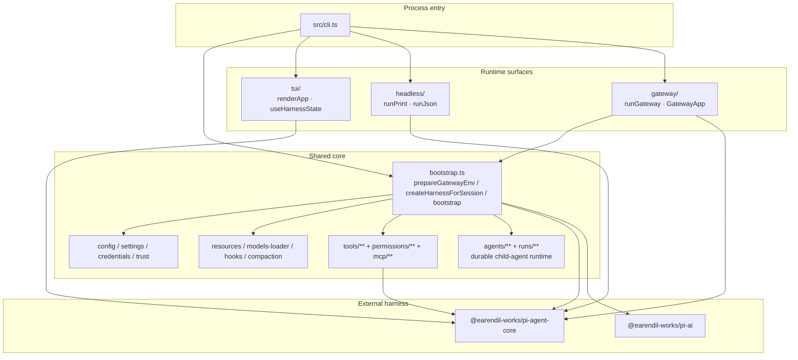
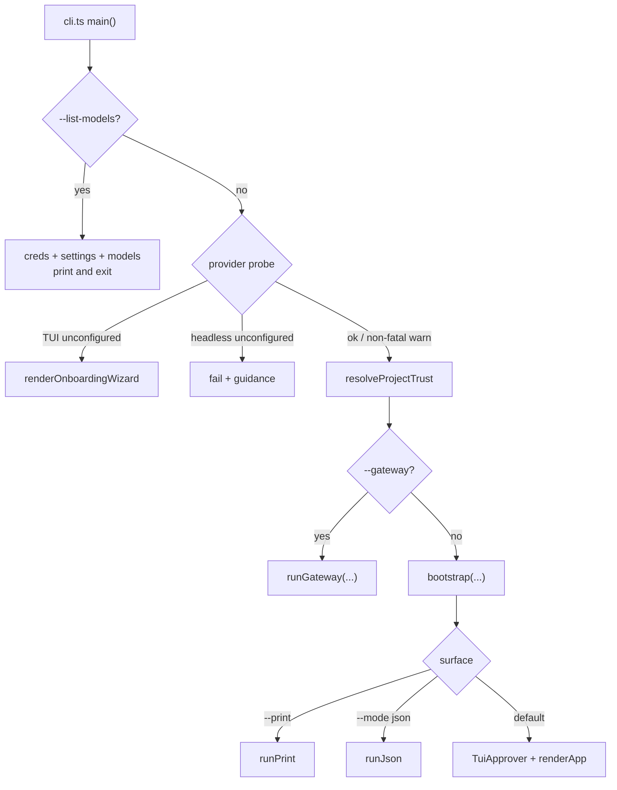
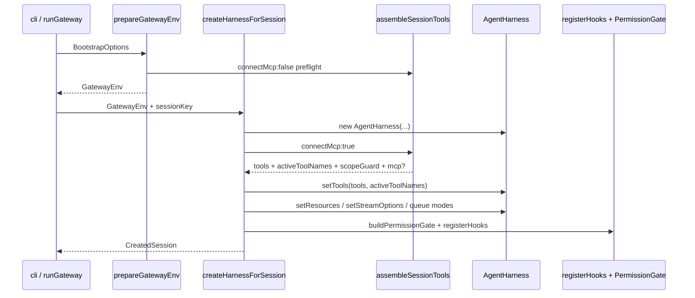
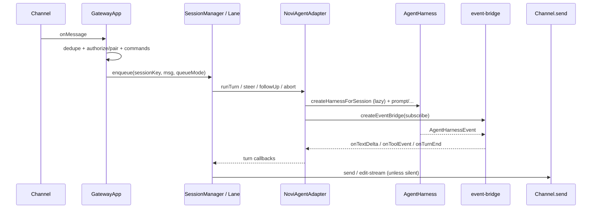
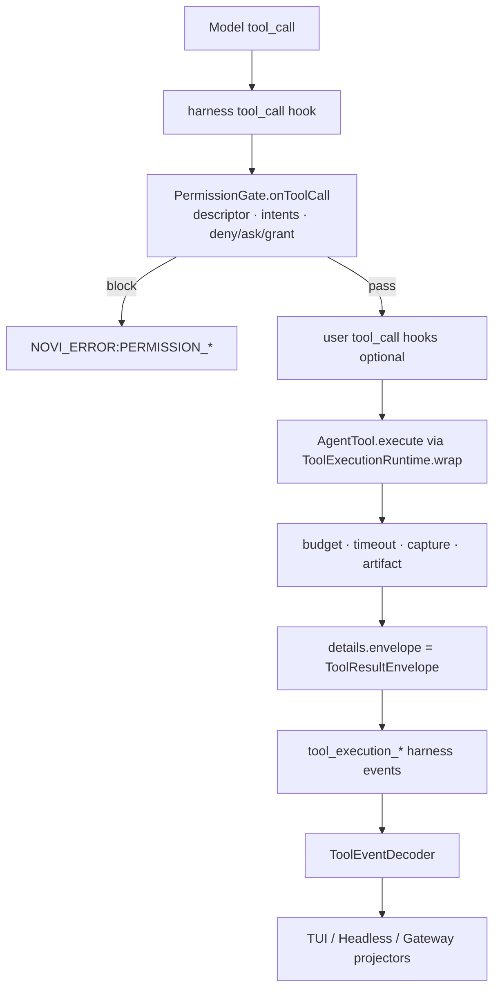

# Novi 架构地图

> 实现级入口文档：帮助贡献者在当前代码树上定位进程入口、运行表面、共享接线、模块边界与关键控制流。  
> 深层契约请跟外链；本文件是**地图**，不是工具/权限/MCP 合同全文。

---

## 1. 概述

**Novi** 是单包 TypeScript ESM 的 agent harness 产品：在 `@earendil-works/pi-agent-core` / `@earendil-works/pi-ai` 之上装配会话、工具、权限、资源与 hooks，并提供三种运行表面：

| 表面         | 入口形态                  | 典型用途                                  |
| ------------ | ------------------------- | ----------------------------------------- |
| **TUI**      | 默认（Ink + React）       | 交互会话、审批、`/commands`、session 切换 |
| **Headless** | `--print` / `--mode json` | 单次 prompt；纯文本或 JSONL 事件流        |
| **Gateway**  | `--gateway`               | 多 channel IM 进程（当前 Telegram）       |

- **包入口**：`package.json` `bin.novi` → `dist/cli.js`；开发入口 `src/cli.ts`（`tsx src/cli.ts`）。
- **运行时**：Node `>=22.19`，`tsc` 产出 ESM（`module: Node16`）。
- **源码树**：全部在 `src/`；无独立 server 包。TUI 在 `src/tui/`，其余为 backend 核心。

### 非目标（读架构时请先记住）

- **不是 OS 沙箱**：`bash` 通过精确命令授权，审批通过后仍受 OS 自身权限约束。
- **不是**工具/权限/web/MCP 的完整契约副本（见 `docs/tool-system.md`、`.trellis/spec/backend/*`）。
- **不是**终端用户产品手册（功能说明见 `README.md`）。
- Workspace 边界（文件工具的 lexical/canonical 判定）≠ 进程隔离。

---

## 2. 系统分层图



**依赖方向要点**

- `gateway/` 可依赖公开 harness 接线（`bootstrap` 辅助、tools、permissions、channel SDK），**禁止** import `src/tui/**`。
- `tui/` 消费 `AgentHarness` 事件与 `BootstrapResult`，不拥有 descriptor/权限策略真相源。
- 工具 payload 解码归属共享 `src/tools/events.ts`；各表面只做投影/渲染。

布局细节：

- Backend：[`.trellis/spec/backend/directory-structure.md`](.trellis/spec/backend/directory-structure.md)
- TUI：[`.trellis/spec/frontend/directory-structure.md`](.trellis/spec/frontend/directory-structure.md)

---

## 3. 进程入口与运行表面

### 3.1 CLI 分发



| 分支        | 条件                   | 主要行为                                                                |
| ----------- | ---------------------- | ----------------------------------------------------------------------- |
| list-models | `--list-models`        | 轻量：credentials + settings + custom providers；**无** session/harness |
| onboarding  | TUI 且 provider 未配置 | `renderOnboardingWizard`（写 credentials/settings 后自行 bootstrap）    |
| trust       | 存在 gated 项目资源    | TUI 可 `renderTrustPrompt`；headless/gateway：`ask`→`never`             |
| gateway     | `--gateway`            | `runGateway`（`status` / `probe` / 默认 `run`）                         |
| print       | `-p` / `--print`       | `bootstrap` → `runPrint`                                                |
| json        | `--mode json`          | `bootstrap` → `runJson`                                                 |
| tui         | 默认                   | `TuiApprover` + `bootstrap` → `renderApp`                               |

互斥：`--print` 与 `--mode json` 不能同时使用。  
`--yes`：工具 ask→allow（**不是** project trust）。  
`--approve` / `--no-approve`：本次运行的 project trust 覆盖。

### 3.2 三表面对照

| 维度       | TUI                                | Headless print                    | Headless JSON            | Gateway                                                 |
| ---------- | ---------------------------------- | --------------------------------- | ------------------------ | ------------------------------------------------------- |
| 装配入口   | `bootstrap`                        | 同左                              | 同左                     | `prepareGatewayEnv` + per-key `createHarnessForSession` |
| `toolMode` | `"tui"`                            | `"print"`                         | `"json"`                 | `"gateway"`                                             |
| 主订阅者   | `useHarnessState`                  | `harness.subscribe`（取最终文本） | `HeadlessEventProjector` | `createEventBridge`（经 `NoviAgentAdapter`）            |
| 权限交互   | `TuiApprover`（once/session/deny） | 非交互 fail-closed                | 同左                     | 非交互 fail-closed（`--yes` 可放宽 ask）                |
| Session    | 单会话 + `/new` `/resume` 重建     | 单次进程会话                      | 同左                     | 多 `sessionKey` 懒创建 + idle 回收                      |
| 生命周期   | 常驻 TUI                           | prompt → 退出                     | JSONL 流 → 退出          | channel 轮询常驻                                        |

---

## 4. 共享核心接线

核心文件：`src/bootstrap.ts`。

### 4.1 三层 API

| 符号                                              | 频率                                                        | 职责                                                                                                                                                                                                                                              |
| ------------------------------------------------- | ----------------------------------------------------------- | ------------------------------------------------------------------------------------------------------------------------------------------------------------------------------------------------------------------------------------------------- |
| `prepareGatewayEnv(options)`                      | 每进程一次（TUI/headless 经 `bootstrap`；gateway 直接调用） | env、credentials 注入、settings、permissions、tool budget、**preflight** `assembleSessionTools(connectMcp:false)`、models + custom providers、system prompt provider、resources、hooks config、stream/queue/thinking 派生值                       |
| `createHarnessForSession(gatewayEnv, sessionKey)` | 每会话                                                      | `JsonlSessionRepo.create` → `new AgentHarness` → **real** `assembleSessionTools(connectMcp:true)` → `setTools(tools, activeToolNames)` → resources → `permissionStoreForHarness` + `buildPermissionGate` → `registerHooks` → stream/queue setters |
| `bootstrap(options)`                              | TUI / print / json                                          | `prepareGatewayEnv` +（`resumePath` 则 open+自装配，否则 `createHarnessForSession(..., "tui")`）→ `BootstrapResult`                                                                                                                               |



### 4.2 关键细节（易踩坑）

- **`setTools` 必须显式传 `activeToolNames`**。省略第二参数时，新 harness 会继承空 active 列表 → 0 工具可用。
- **`permissionStoreForHarness(mode, shared)`**：`gateway` 模式每次新建 `SessionPermissionStore`；TUI 重建复用同一 store（session grant 存活）。
- **`buildPermissionGate`**：有 `approver` → 交互门；否则 `createNonInteractivePermissionGate`。
- **resume**：仅 `bootstrap({ resumePath })` 路径；`createHarnessForSession` 始终新建 session。
- **hooks**：`registerHooks(..., { permissionGate })` 保证 `tool_call` 上 **PermissionGate 先于** 用户 hook。

pi-agent-core 公开 API 细节：[`.trellis/spec/backend/pi-agent-core-api.md`](.trellis/spec/backend/pi-agent-core-api.md)。

### 4.3 TUI harness 重建

`src/tui/harness-handle.ts` 的 `HarnessHandle.replace` 用于 `/reload`、`/new`、`/resume`：

1. `waitForIdle` → 新 `AgentHarness`
2. `replayHarnessState`（public getter/setter；tools 经 `assembleSessionTools`）
3. 换 React handle identity → `useHarnessState` 自动重订阅

Trust **不热重载**：`/trust` 写 `trust.json`，下次启动才改变 `includeProject`。

---

## 5. 工具系统地图

**权威长文**：[docs/tool-system.md](docs/tool-system.md)  
**可执行契约**：[`.trellis/spec/backend/tool-runtime-contracts.md`](.trellis/spec/backend/tool-runtime-contracts.md)  
**Web 工具**：[`.trellis/spec/backend/web-tools.md`](.trellis/spec/backend/web-tools.md)

### 5.1 分层一句话

1. **Descriptor**（`tools/contracts.ts`）：工具是什么、能力、默认权限、modes、factory、intent resolver
2. **Registry**（`tools/registry.ts`）：校验 + exposure/permission 算出 active set
3. **Assembly**（`tools/index.ts` / `assembly.ts`）：builtin ± MCP → `ToolAssembly`
4. **Runtime wrap**（`tools/runtime/**`）：超时 / 并发 / 截断 / artifact / envelope
5. **PermissionGate**（`permissions/gate.ts`）：deny-first 能力 + 作用域审批
6. **Events**（`tools/events.ts`）：`ToolEventDecoder` + `reduceToolCallState` → 三表面共用

### 5.2 装配入口

| API                         | 同步/异步 | 用途                                        |
| --------------------------- | --------- | ------------------------------------------- |
| `createBuiltinToolAssembly` | 同步      | 仅内建                                      |
| `createToolAssembly`        | 异步      | 内建 + 可选 MCP                             |
| `assembleSessionTools`      | 异步      | 会话统一入口（resolve plan + connect 策略） |

### 5.3 Exposure vs Permission

- **Exposure**：模型能否看见/调用该工具名（active set）
- **Permission**：本次 input 是否允许执行（gate + grants）
- whole-tool `deny` / disable / unavailable 从 active set 移除；runtime gate 仍可防御 stale call。

### 5.4 跨表面工具事件（不变量）

- **唯一解码器**：`src/tools/events.ts` 的 `ToolEventDecoder` / `ToolResultEnvelope`
- 消费方：TUI `useHarnessState`、headless `HeadlessEventProjector`、gateway `createEventBridge`
- **禁止**各表面自行解析 pi 的 raw `tool_execution_*` 语义或复制错误码映射
- non-tool 消息投影可表面本地（TUI 渲染、headless JSON 白名单、gateway channel 回调）

内建工具目录锚点：`read_file` / `write_file` / `edit_file` / `bash` / `ls` / `glob` / `grep` / `todo` / `web_search` / `fetch_content`（见 `src/tools/index.ts`）。

---

## 6. MCP 集成地图

模块：`src/mcp/**`；会话合并：`src/tools/assembly.ts`。

| 组件   | 文件                    | 作用                                                          |
| ------ | ----------------------- | ------------------------------------------------------------- |
| 配置   | `mcp/config.ts`         | 用户 `~/.novi/mcp.json` + 项目 `.mcp.json` / `.novi/mcp.json` |
| 审批   | `mcp/approval.ts`       | `~/.novi/mcp-approvals.json`（与 project **trust 独立**）     |
| 计划   | `mcp/plan.ts`           | `resolveMcpPlan` → connectable / pending / denied / invalid   |
| 传输   | `mcp/transport.ts`      | stdio + Streamable HTTP                                       |
| 客户端 | `mcp/client-manager.ts` | connect / list / call / close                                 |
| 适配   | `mcp/tool-adapter.ts`   | MCP → external `ToolDescriptor`（默认 ask、optional）         |

**行为摘要**

- 用户级 server：无需额外审批即可 connectable；项目级默认 pending，按 projectRoot + name + fingerprint 批准。
- **Project trust ≠ MCP approval**：信任项目 settings/skills **不会**自动批准 MCP。
- Fail-soft：连接失败记 diagnostics，不拆除 builtin。
- Preflight：`connectMcp:false` 只诊断 plan；真实会话才 spawn。
- 关闭：`McpRuntimeHandle.close` 在 harness replace / quit / gateway `closeSession` 路径执行。

运维向说明见 `README.md` MCP 小节；持久化约定见 [database-guidelines](.trellis/spec/backend/database-guidelines.md)。

---

## 7. Agent Run Runtime

**设计说明**：[docs/agent-runs-design.md](docs/agent-runs-design.md)
**代码根**：`src/agents/`、`src/runs/`

`bootstrap` 为 TUI/Headless 创建当前 parent 的 runtime；`runGateway` 创建
覆盖所有 route 的单一 runtime。父 harness 注入 `agents` 与
`agents_yield` descriptor，`AgentRunManager` 统一负责 durable ledger、全局/
parent 并发、cwd 写租约、取消、恢复和 completion。每个 child 通过
`createHarnessForSession` 获得独立 session，并按 profile 对父 tools、模型、
thinking、skills、MCP 与 permissions 做交集收紧。

completion 先写 run ledger，再由表面适配器回灌父 session。Gateway 必须经过
对应 route 的 system-operation lane，并把最终回复写入 durable outbox；TUI/
Headless 使用本地串行 completion lane。普通父 turn abort 不取消 child，
`/new` 则取消旧 session generation。

## 8. Gateway 子系统

**设计与运维**：[docs/gateway-design.md](docs/gateway-design.md)
**代码根**：`src/gateway/`

### 8.1 启动（`runGateway`）

1. `status` / `health` / `messages` 通过私有 control socket；`migrate` / `service` 进入各自运维层（均无 harness）
2. 默认 `run` 先做只读 schema preflight，再做 provider probe（未配置则 fail + guidance）
3. trust（headless 规则）
4. `prepareGatewayEnv({ toolMode: "gateway" })`
5. `loadGatewayConfig`（`${ENV}` 展开；项目层受 trust）
6. 打开严格的 `JobStore`，装配 `JobService` / runner / delivery / scheduler / Heartbeat
7. `createChannels` + `NoviAgentAdapter` + `GatewaySessionManager` + `GatewayApp`
8. channels ready 后 scheduler 取得单 owner lock、reconcile 并 dispatch
9. `SIGHUP`：仅 access / group-routing 热更；token/channel/queue/automation 等需重启
10. SIGINT/SIGTERM → scheduler 停止 claim/排空，再 `app.stop()`

### 8.2 组件边界

| 组件                      | 路径                                        | 职责                                                             |
| ------------------------- | ------------------------------------------- | ---------------------------------------------------------------- |
| `GatewayApp`              | `core/gateway-app.ts`                       | 入站：dedupe → 授权/配对 → slash commands → session lane         |
| `GatewaySessionManager`   | `core/session-manager.ts`                   | per-sessionKey lane、idle timeout、maxConcurrent 驱逐            |
| Session lane              | `core/session-lane.ts`                      | 串行队列；running 时 steer / followup / interrupt；静默标记缓冲  |
| `NoviAgentAdapter`        | `agent/novi-agent-adapter.ts`               | `AgentProtocolAdapter` 实现；懒 `createHarnessForSession`        |
| `createEventBridge`       | `agent/event-bridge.ts`                     | **唯一** gateway 侧 harness 订阅点                               |
| Channels                  | `channels/*`                                | 如 Telegram long-poll + edit-stream                              |
| Pairing                   | `core/pairing-store.ts`                     | DM pairing fail-closed 持久授权                                  |
| `JobStore` / `JobService` | `jobs/store.ts` / `jobs/service.ts`         | 严格文件状态、route 所有权、生命周期与预算账本                   |
| `GatewayScheduler`        | `jobs/scheduler.ts`                         | occurrence claim、恢复、执行/投递重试与清理                      |
| Automation / Delivery     | `jobs/agent-runner.ts` / `jobs/delivery.ts` | 隔离受限 run；至少一次 Telegram 投递；来源 Session 追加          |
| Heartbeat                 | `jobs/heartbeat.ts`                         | due-item 计算、active hours、静默与单例低频检查                  |
| Runtime control           | `runtime/*`                                 | 私有 Unix socket、真实 health/status、结构化日志/指标/告警       |
| State migrations          | `migrations/*`                              | schema inventory、私有备份、事务迁移、崩溃恢复与 rollback        |
| systemd user service      | `service/*`                                 | deterministic unit、安装 ownership、生命周期、linger/status/logs |

### 8.3 架构规则

- **N1**：`gateway/` **不得** import `tui/`。
- **N2**：channels 只收 callbacks，不直接读 `AgentHarnessEvent`。
- `AgentProtocolAdapter` 协议中立：当前 in-process `NoviAgentAdapter`；未来远程适配可替换而不改 `GatewayApp`。
- multi-turn 工具调用：bridge 在 `message_end`(assistant) 缓冲文本，**仅在 `agent_end`** 调 `onTurnEnd`（避免多条“最终回复”）。
- 静默投递：最终文本为 `SILENT` / `[SILENT]` / `NO_REPLY` / `NO REPLY` 时不发送；lane 对可能的 marker 前缀缓冲再放行 delta。

### 8.4 Gateway 入站流



---

## 9. 关键控制 / 数据流

### 9.1 交互一轮（TUI）

```text
用户输入 (InputBox / command / bang)
  → harness.prompt | skill | ...
  → AgentHarness run (agent_start → turns → agent_end)
  → useHarnessState.subscribe
       ├─ ToolEventDecoder → reduceToolCallState → ToolCallBlock
       └─ 文本/thinking/status 本地投影
  → AutoCompactor 在 settled 后可能 compact
  → JSONL session 由 pi-agent-core 追加
```

### 9.2 Tool call 路径



权限错误稳定前缀：`NOVI_ERROR:<code>:<message>`（见 tool-runtime-contracts）。

### 9.3 Headless JSON 生命周期

```text
bootstrap → stdout projectToolCatalog(...)（type: "tools_update"）
  → HeadlessEventProjector 订阅
  → harness.prompt(fullPrompt)
  → 白名单 JSONL 行（含 tool.start/delta/end，无 hook 重复）
  → 成功 exit 0；错误写 {type:"error"} + stderr + exit 1
  → close MCP handle
```

`--print` 通过 `harness.subscribe` 保留最后一次 assistant `message_end` 文本后退出，不发射完整事件协议。

### 9.4 Gateway 入站（摘要）

见 §7.4。额外：授权顺序是 **先 normalize/dedupe，再授权**；group 内的 pairing approve 不得转发进 agent；session key 含 forum topic 维度，避免与父 chat 共享 harness。

---

## 10. 持久化与配置面

Novi **无数据库**；文件持久化。总览：[database-guidelines](.trellis/spec/backend/database-guidelines.md)。

根目录：`getNoviDir()` → `$NOVI_HOME` 或 `~/.novi`。

| 路径                                             | 内容                                                       |
| ------------------------------------------------ | ---------------------------------------------------------- |
| `~/.novi/settings.json`                          | 全局 settings（与项目 `<cwd>/.novi/settings.json` 浅合并） |
| `~/.novi/credentials.json`                       | API keys（`0600`；与 settings 物理隔离）                   |
| `~/.novi/trust.json`                             | project trust 决策                                         |
| `~/.novi/models.json`                            | 自定义 provider；项目层受 trust                            |
| `~/.novi/mcp.json`                               | 用户 MCP servers                                           |
| `~/.novi/mcp-approvals.json`                     | 项目 MCP 批准/拒绝                                         |
| `~/.novi/gateway.json`                           | gateway 配置（项目层可叠加，受 trust）                     |
| `~/.novi/jobs/store.json`                        | job 定义、预算与 Heartbeat runtime state                   |
| `~/.novi/jobs/runs/<jobId>/<runId>.json`         | 原子、版本化、有界的主动 run 记录                          |
| `~/.novi/agent-runs/runs/<parentId>/<runId>.json` | 子代理状态、策略快照、usage、结果与 completion ledger       |
| `~/.novi/HEARTBEAT.md`                           | 用户级低频主动检查指令                                     |
| `~/.novi/sessions/<encoded-cwd>/…jsonl`          | `JsonlSessionRepo` 会话                                    |
| `~/.novi/todos/<sessionId>.json`                 | 会话 todo                                                  |
| `~/.novi/artifacts/<session>/…`                  | 工具溢出全文（配额/模式见 runtime）                        |
| `~/.novi/cache/web/…`                            | web_search / fetch_content 缓存                            |
| `~/.novi/hooks/hooks.json`                       | 用户 hooks；项目层受 trust                                 |
| `~/.novi/{skills,prompts,SYSTEM.md,AGENTS.md,…}` | 资源与 prompt 层                                           |

**配置优先级（常见）**：CLI 显式覆盖 > 项目 settings（受 trust / tighten-only 规则）> 全局 > 内建默认。

**两条信任线**

1. **Project trust**（`/trust`、`--approve`）：settings / skills / prompts / models / hooks / project gateway 层
2. **MCP approval**：项目 MCP fingerprint；独立文件、独立决策

---

## 11. 模块索引 / 延伸阅读

### 11.1 源码锚点

| 区域        | 路径                                             | 说明                                                          |
| ----------- | ------------------------------------------------ | ------------------------------------------------------------- |
| CLI         | `src/cli.ts`                                     | 参数解析与表面分发                                            |
| 接线        | `src/bootstrap.ts`                               | `prepareGatewayEnv` / `createHarnessForSession` / `bootstrap` |
| 路径        | `src/config.ts`                                  | `getNoviDir` / `getSessionsDir`                               |
| Settings    | `src/settings.ts`                                | 双层加载与 resolve                                            |
| Credentials | `src/credentials.ts`                             | 密钥存储与 env 注入                                           |
| Trust       | `src/trust.ts`                                   | project trust store                                           |
| Models      | `src/models-loader.ts`                           | `models.json` → pi-ai providers                               |
| Resources   | `src/resources.ts`                               | skills + prompt templates                                     |
| Compaction  | `src/compaction.ts`                              | `AutoCompactor`                                               |
| Tools       | `src/tools/**`                                   | descriptors / registry / assembly / runtime / events          |
| Permissions | `src/permissions/**`                             | policy / gate / scope / TuiApprover                           |
| MCP         | `src/mcp/**`                                     | plan / approval / client / adapter                            |
| Hooks       | `src/hooks/**`                                   | 用户脚本 hooks + gate compose                                 |
| Headless    | `src/headless/**`                                | print / json / projector                                      |
| Gateway     | `src/gateway/**`                                 | multi-channel 子系统                                          |
| Agent runs  | `src/agents/**` / `src/runs/**`                 | 子代理策略、执行、队列、恢复、completion 与共享运行基础       |
| TUI         | `src/tui/**`                                     | Ink UI；`useHarnessState` 唯一 harness 订阅                   |
| Images      | `src/images/**`                                  | 多模态附件编码 / clipboard                                    |
| Onboarding  | `src/onboarding.ts` + `tui/OnboardingWizard.tsx` | provider 引导                                                 |

### 11.2 深文档

| 主题                     | 文档                                                                                               |
| ------------------------ | -------------------------------------------------------------------------------------------------- |
| 工具系统全景             | [docs/tool-system.md](docs/tool-system.md)                                                         |
| 工具运行时/权限/事件契约 | [.trellis/spec/backend/tool-runtime-contracts.md](.trellis/spec/backend/tool-runtime-contracts.md) |
| Web tools                | [.trellis/spec/backend/web-tools.md](.trellis/spec/backend/web-tools.md)                           |
| pi-agent-core API        | [.trellis/spec/backend/pi-agent-core-api.md](.trellis/spec/backend/pi-agent-core-api.md)           |
| Backend 目录             | [.trellis/spec/backend/directory-structure.md](.trellis/spec/backend/directory-structure.md)       |
| TUI 目录                 | [.trellis/spec/frontend/directory-structure.md](.trellis/spec/frontend/directory-structure.md)     |
| 持久化                   | [.trellis/spec/backend/database-guidelines.md](.trellis/spec/backend/database-guidelines.md)       |
| Gateway 运维             | [docs/gateway.md](docs/gateway.md)                                                                 |
| 子代理与后台运行         | [docs/agent-runs-design.md](docs/agent-runs-design.md)                                             |
| 功能与 MCP/权限用户说明  | [README.md](README.md)                                                                             |

---

## 12. 维护说明

1. **本文件保持“薄地图”**：新增长表、provider 矩阵、完整 event schema 应写进 `docs/*` 或 `.trellis/spec/*`，这里只加锚点与链接。
2. **改接线时同步核对**：`cli.ts` 分支、`bootstrap` 三 API、`assembleSessionTools`、`GatewayApp` 授权顺序、各表面订阅点。
3. **符号以代码为准**：若实现与旧文档冲突，更新架构声明；冲突严重时在对应 deep doc 记差异。
4. **不要从 git 历史回填**已删除文稿措辞；以当前工作树为准。
5. 图示仅用 Mermaid；散文与链接是事实源。
6. 语言约定：中文叙述，路径 / 类型 / 函数名保持英文标识符。

### 跨表面不变量速查

| #   | 规则                                                                                  |
| --- | ------------------------------------------------------------------------------------- |
| 1   | `tools/events.ts` 拥有 tool payload 解释权                                            |
| 2   | `gateway/` 不 import `tui/`                                                           |
| 3   | 每表面单一主订阅：TUI `useHarnessState` / headless projector / gateway `event-bridge` |
| 4   | 仅 TUI 默认可交互 Approver；headless/gateway ask 非交互 fail-closed，除非 `--yes`     |
| 5   | project trust ≠ MCP approval                                                          |
| 6   | workspace 边界 ≠ OS sandbox；`bash` 是 exact-command 授权                             |

---

_基于当前工作树编写。实现变更时请以 `src/**` 为准并回写本节链接目标。_
