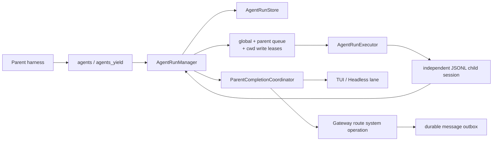

# Novi 子代理与后台运行设计

## 定位

Novi 把“立即委派”和“定时自动化”保留为两种不同原语：

- `AgentRun` 是父 Agent 立即创建的子任务。spawn 先落盘后返回，子 harness
  在当前进程后台执行，完成后自动唤醒父会话。
- `ScheduledJob` 是带 schedule cursor、预算和主动投递的长期定义。它能跨
  重启重新 claim occurrence，但不属于父子 Agent 树。

二者共享有界 harness 执行、错误规范和 Gateway provider 并发 limiter，
但不共享 ledger、恢复承诺或公开工具合同。这样既能支持 Hermes/Claude Code
式的三路并行委派，也不会把未完成的 LLM 调用伪装成可从任意现场恢复的
durable workflow。

## 组件边界

- `types.ts` 定义 version 1 run、profile、parent generation 与 domain events。
- `store.ts` 是状态真相源；每个 run 独立 JSON，首次创建用 exclusive create，
  更新用原子 rename。
- `manager.ts` 是唯一状态转换入口，负责队列、attempt、取消、写租约、恢复和
  completion retry timer。
- `profiles.ts` 把子 profile 与父能力求交集；executor 只消费冻结后的
  `policySnapshot`。
- `completion.ts` 先提交 terminal/pending，再调用表面 sink；sink 不能反过来
  修改 run 状态。

## 执行与隔离

每个 child 都是独立 `JsonlSessionRepo` session：

- `isolated` 只得到 task/context，不读取父历史。
- `fork` 固定在 spawn 时的 parent leaf，后续父会话变化不会改变 child 输入。
- child session/transcript 保留，run ledger 只保存 metadata、usage 和有界结果。

默认 profile：

| profile | 写入 | 典型用途 |
| --- | --- | --- |
| `explorer` | 否 | 搜索、阅读、证据收集 |
| `reviewer` | 否 | 审查、风险分析、验证 |
| `worker` | 仅父已允许时 | 实现与修改 |

profile 只能收紧父会话已有的 model/thinking/tools/skills/MCP/permissions。
`agents`、`agents_yield`、`jobs` 和 channel 消息能力不会进入 child，因此首版
保持 depth 1，也避免子任务直接对外发消息。

## 并发模型

默认 `maxConcurrent=8`、`maxChildrenPerParent=5`，所以“3 子代理”是明确的
验收基线，不是硬编码上限。manager 还施加两条约束：

1. 同一规范化 cwd 同时最多一个 writable child；租约在成功、失败、取消和
   中断路径都释放。
2. Gateway 的 AgentRun 与 scheduled automation 共同经过
   `RunConcurrencyLimiter(automation.maxConcurrentLlmRuns)`，防止两套入口的
   provider 调用叠加失控。该 limiter 是进程内 FIFO，不声称跨进程全局限流。

## Completion 与父会话串行化

child 终态顺序固定为：

1. 持久化 result/error/usage 与 terminal status。
2. 把 completion 写为 `pending`。
3. coordinator 改为 `delivering` 并调用 sink。
4. sink 按 `idempotencyKey` 追加隐藏的 `novi.agent-completion` custom entry。
5. 触发一次内部 parent prompt，让父 Agent 验证并综合 child 报告。
6. 成功后记录 `delivered`；可重试失败记录 `nextAttemptAt` 并由 manager 定时重试。

TUI/Headless 用 parent owner 的本地串行 lane；内部 wake 不作为普通用户消息
展示。Gateway completion 必须进入对应 route 的
`GatewaySessionManager.enqueueSystemOperation`，因此 parent 忙时排在当前 turn
后面。父回复最终使用 deterministic system source id 写 durable outbox；即使
“outbox 已创建、completion ledger 尚未提交”时崩溃，重试也只会命中同一条
outbox 记录。

## 取消与恢复

- 父 turn 的普通 abort 只中止父生成，不取消 child。
- cancel 单 run 会递归取消后代；cancel-all 仅作用于当前 parent generation。
- `/new` 在 session rotate 前取消旧 generation。被 reset 丢弃的 queued system
  operation 必须 reject，不能留下永不 settle 的 Promise。
- 重启时 queued 保持 queued 且 attempt 不变。
- 旧进程的 starting/running 先记为 interrupted。只读、retryable 且仍有 attempt
  的 run 可重排一次；worker 不自动重放。
- delivering 恢复为带 ambiguity 的 pending；completion 不重跑 child，只重试
  parent handoff。

这不是 LangGraph 式 step checkpoint。正在执行的任意 tool/LLM 调用不会从
内存现场续跑；系统只在明确安全边界上重排只读任务。

## 操作面

- TUI/Gateway：`/agents list|info|log|cancel|retry|stop-all`。
- Gateway 本地控制：`agents.list|get|cancel|retry`，CLI 对应
  `novi --gateway agents ...`。
- Headless JSON 投影统一的 `agent_run` / `agent_completion` 事件，并在当前 parent
  的 run/completion 收敛后退出。
- Gateway snapshot/metrics 只暴露 queued/running/interrupted/
  pending-completion/delivery-failed 和 usage 汇总；control list/get 不返回 task、
  result、错误全文或 transcript path。

## 明确不做

首版不实现 worktree 自动创建/合并、depth 2 编排、peer messaging、跨机器 worker
pool、通用 DAG、任意 tool replay 或多进程 semaphore。请求 worktree 会明确返回
`WORKTREE_UNSUPPORTED`，不会静默降级到共享目录。

