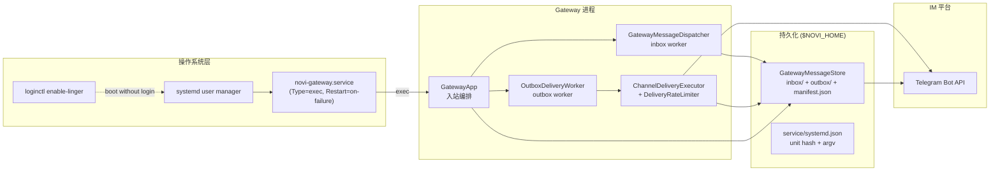
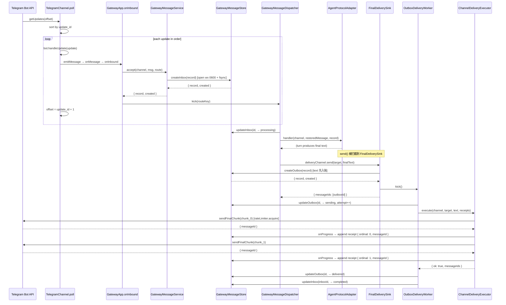

# Novi Agent 常驻服务与可靠投递设计讲解

## 整体概览

Novi 有三种运行表面：交互式 TUI、一次性 headless、以及 Gateway（`novi --gateway`）。前两者面向"人在终端前"的场景，进程生命周期与一次会话绑定；Gateway 是**常驻进程**，挂着 IM channel，在无人值守时持续把外部消息变成 agent 会话、再把回复送回原对话。`docs/gateway-design.md` 讲的是入站主线（channel → app → session lane → agent），`docs/scheduled-jobs-design.md` 讲的是主动闭环（jobs / heartbeat / job delivery）。本文补第三块拼图：**Gateway 为什么需要操作系统级的常驻机制，以及在进程随时可能崩溃的前提下如何保证消息不丢、回复可靠送达。**

这两件事在源码里由两个独立但配合的子系统承担：

- **systemd user service**（`src/gateway/service/`）：把 Gateway 进程变成一个受 systemd 管理的用户级服务单元，解决"谁来启动、崩溃后谁来重启、用户未登录时进程是否还在"这类操作系统层面的问题。
- **durable message store + inbox/outbox 投递**（`src/gateway/messages/`）：把入站消息的"已收到"事实和出站回复的"待送达"事实写入磁盘，用状态机管理它们的生命周期，使进程崩溃和重启不影响已持久化的事实。

最重要的设计思想是**把易失的进程内状态变成可恢复的磁盘事实，并对入站与出站施加不对称的可靠性语义**：

1. **入站 accept-before-ack**：消息在进入内存处理之前先落盘；轮询 offset 只在持久化成功后才推进。崩溃后重启不会丢失未处理的消息，也**不会**自动重跑已经中断的 Agent/工具调用。
2. **出站至少一次投递**：Agent 产出的最终文本先作为 outbox 记录入账，再由独立 worker 重试投递；崩溃留在 `sending` 状态的记录被标记为 ambiguous/possible duplicate 后继续重试，但绝不重新调用 Agent。
3. **OS 常驻与消息持久化互补**：systemd 负责进程的可靠重启与无人值守驻留，durable store 负责跨重启的状态恢复；二者缺一都无法实现真正的无人值守。

`src/gateway/runtime/`（控制 socket、metrics、logger、alerts）是常驻进程的运维入口与可观测边界，本文只在交界处简要提及，不展开其内部设计。

---

## 要解决的问题

如果只看"收消息 → 调模型 → 回消息"，一个简单的 `bot.on("message", runAgent)` 循环似乎就够了。但常驻 IM 网关至少面临三层可靠性约束，每一层都让 best-effort 循环不够用。

### 1. 进程随时可能不在

TUI 和 headless 的进程生命周期由用户控制：用户退出，进程就消失。Gateway 要在无人值守时持续服务，这意味着进程会因机器重启、OOM、channel SDK 异常、或用户手动 `systemctl stop` 而随时终止。如果没有操作系统层面的管理，就需要用户每次登录后手动启动 Gateway——这违背"无人值守"的初衷。

更微妙的是：即使进程在运行，如果它在处理消息时崩溃，内存中所有未完成的工作都会丢失。一个 best-effort 循环在 `bot.on("message")` 回调里直接调用 Agent，如果进程在 Agent 执行中途崩溃，这条消息就消失了——用户不会收到回复，也不会知道消息被丢掉了。

### 2. 入站消息的"已收到"事实不能只存在内存里

Telegram 等 IM 平台用 long-polling（`getUpdates`）拉取更新，靠 offset 标记"已处理到哪条"。Telegraf 的默认行为是：`bot.handleUpdate(update)` 返回后，轮询循环推进 offset。如果回调内部只是 `void runAgent(ctx)`（fire-and-forget），offset 会在 Agent 还在跑时就推进——此时进程崩溃，Telegram 不会再重投这条更新，消息就永久丢失了。

反过来，如果回调在 Agent 跑完才推进 offset，那 Agent 每次崩溃都会导致整批更新重新投递——但 Agent 已经产生过副作用（工具调用、外部写入），重新跑一遍是危险的。所以问题不是"要不要重试"，而是**入站和出站的可靠性语义必须分离**：入站消息的接收事实必须先于处理落盘，但处理本身不能自动重跑。

### 3. 出站回复的"已送达"事实也不能只存在内存里

Agent 产出最终文本后，需要调用 `channel.send()` 把文本发回 IM。这一步同样可能失败：网络抖动、Telegram 429 限流、5xx 服务不可用、进程在 `send` 调用中途崩溃。如果回复文本只存在于 Agent 的内存返回值里，崩溃就意味着这条回复永远消失了——用户等了半天，什么都没收到。

更棘手的是：`send` 可能是分块的（`sendFinalChunk`），进程在第 2 块发送后、第 3 块发送前崩溃。重启后如果盲目重发整个回复，前 2 块会重复出现在用户的聊天里。所以出站投递需要**至少一次**语义（at-least-once），同时需要**持久化已送达的块游标**和**标记可能重复**，让重试从断点继续而不是从头开始。

### 4. 限流是平台硬约束，不是可选优化

Telegram Bot API 有三层速率限制：account 级（25 msg/s）、direct chat 级（1 msg/s）、group 级（20 msg/min），以及服务端通过 `retry_after` 返回的动态冷却。Gateway 常驻进程同时处理入站会话、出站投递、定时任务投递，如果各自直接调用 channel API，会在生产负载下频繁触发 429。限流因此是投递正确性的一部分，不是性能调优。

这四层约束的共同指向是：**常驻进程不能假设自己永远活着，也不能假设网络调用永远成功**。systemd user service 解决"进程如何可靠地活着"，durable inbox/outbox 解决"事实如何跨越进程死亡而存活"。下文分别展开这两个子系统，再讲它们如何配合。

---

## 核心抽象

### systemd user service：受托管的长生命周期进程

`src/gateway/service/` 把 Gateway 进程变成一个 systemd 用户级服务。它不引入新的运行时逻辑，而是把一个普通 Node 进程的启动、停止、重启交给操作系统的 init 系统管理。关键抽象有三个：

**`GatewayServiceSpec`**（`types.ts`）是服务的"身份快照"：`nodePath`（Node 可执行文件绝对路径）、`cliPath`（编译后的 `dist/cli.js`）、`cwd`、`noviHome`（`NOVI_HOME`）、可选的 `configPath` 和 `environmentFile`。这份 spec 被冻结成确定性 unit 文本和私有 manifest，是服务身份的唯一来源。

**unit 文本**（`renderGatewayUnit` in `unit.ts`）是一个固定形状的 systemd `[Service]` 单元：`Type=exec`、`Restart=on-failure`、`RestartSec=5s`、`TimeoutStopSec=60s`、`KillSignal=SIGTERM`、`RuntimeDirectory=novi`（mode `0700`）。`ExecStart` 由 `serviceArgv(spec)` 拼出 `node dist/cli.js --gateway --cwd <cwd> [--config <path>]`，每段 token 用 `quoteSystemd` 编码（`%` 双写以禁用 specifier 展开）。路径型指令（`WorkingDirectory`、`EnvironmentFile`）用 `escapeSystemdPath` 做 `\xNN` 转义而非加引号，因为引号会成为路径字节的一部分。

**`GatewayServiceManifest`**（`types.ts`）是写入 `$NOVI_HOME/service/systemd.json` 的私有 manifest，记录 unit 的 SHA-256 hash、冻结的 argv、unit 路径和安装时间，文件权限 `0600`。它的作用是"证明这个 unit 是 Novi 安装的"——uninstall 时通过比对 hash 判断 unit 是否被外部修改过，避免误删用户手动编辑的文件。

### durable message store：版本化的事实日志

`GatewayMessageStore`（`store.ts`）是 inbox/outbox 记录的持久化层，根路径为 `$NOVI_HOME/gateway-messages`。它的设计不是数据库，而是一组**严格版本化、分片存储、原子写入的 JSON 文件**，每条记录就是一个不可变事实。

**记录 ID 是确定性的**（`types.ts`）：inbox id 由 `channel + account + nativeUpdateId`（+ retry 时追加 attempt）做 SHA-256 截断 32 字符；outbox id 由 `source.kind + source.id + source.attempt + source.purpose + source.ordinal` 派生。这意味着同一意图重复 create 不会产生新记录——store 用 `open("wx", 0600)` 独占创建，`EEXIST` 时回读已有记录并校验意图一致（`assertSameInboxIntent`），实现幂等去重。

**记录按 id 前两字符分片**存储在 `inbox/xx/<id>.json` 和 `outbox/xx/<id>.json`，文件权限 `0600`。更新走同目录临时文件 → `fsync` → rename → 目录 sync 的原子路径（`atomicWrite`）。内存中的状态只在磁盘操作成功后才修改（`createInbox` / `updateInbox` / `createOutbox` / `updateOutbox` 都是先写盘再改 Map），所以内存崩溃不会产生"磁盘写了但内存没改"的不一致。

**状态机由 `INBOX_TRANSITIONS` / `OUTBOX_TRANSITIONS` 两个白名单表强制**（`types.ts`），任何非法转换在 `assertInboxTransition` / `assertOutboxTransition` 处抛错。store 在 update 时还校验"持久化意图字段不可变"（`assertInboxUpdate` / `assertOutboxUpdate`）：identity、route、message、text、contentHash、maxAttempts、createdAt 等字段一旦写入就不能改，只有 status、receipts（append-only）、attempt、timestamps、error 可变。

### inbox 与 outbox 记录：两条不对称的生命周期

**`InboxRecord`** 代表一条入站消息的接收事实，状态为 `received → processing → completed | interrupted | failed | dismissed`。关键字段：`identity`（channel/account/nativeUpdateId 三元组）、`route`（绑定到哪个 session）、`attempt`（第几次尝试，0 为原始，>0 为 retry 子记录）、`parentMessageId`（retry 子记录的父 id）、`deliveryIds`（关联的 outbox 记录 id，append-only）。

**`OutboxRecord`** 代表一条出站投递意图，状态为 `pending → sending → delivered | delivery_failed | dismissed`。关键字段：`source`（来源是 inbox 还是 system、来源 id、attempt、purpose、ordinal）、`target`（投递目标 locator）、`text`（最终文本，最多 64 KiB）、`contentHash`（文本的 SHA-256）、`receipts`（每块成功送达后追加 `{ordinal, messageId, deliveredAt}`）、`attempt` / `maxAttempts`（默认 4 次）、`deliveryAmbiguous` / `possibleDuplicate`（崩溃恢复标记）。

两条记录的不对称性是整个设计的核心：inbox 的 `processing` 状态崩溃后**不自动重跑**，只变成 `interrupted`；outbox 的 `sending` 状态崩溃后**自动继续重试**，但标记为可能重复。

### 投递执行器与限流器：共享的投递引擎

`ChannelDeliveryExecutor`（`delivery.ts`）负责执行一次有界的 channel API 调用，但不负责重试调度——重试是 outbox worker 的 store 级别决策。executor 的职责是：分块（`chunkText`）、逐块调用 `sendFinalChunk`、每块成功后通过 `onProgress` 回调持久化 receipt、遇到错误时用 `classifyChannelError` 分类。

`DeliveryRateLimiter`（`rate-limit.ts`）是 reservation-based 令牌桶，分 account 和 target 两个 scope，默认值为 25/1/20，配置**只能收紧不能放宽**（`resolveLimits` 拒绝超过默认值的配置）。它也被 scheduled jobs 的 `DeliveryService` 共享——这是两条投递主线（durable outbox 和 jobs delivery）的共享边界。

### 运维入口：控制 socket 与 `/messages` 命令

常驻进程的运维操作不经过 channel，而是通过两个路径：进程内的 `GatewayControlServer`（Unix socket，newline-delimited JSON 协议，`src/gateway/runtime/control-server.ts`）暴露 `status.get` / `health.live` / `health.ready` / `messages.list` / `messages.retry` / `messages.retryDelivery` / `messages.dismiss` 方法；用户侧的 `novi --gateway messages` / `novi --gateway status` CLI 通过 `requestGatewayControl`（`control-client.ts`）连这个 socket。chat 内的 `/messages list|retry|retry-delivery` slash 命令也由 `GatewayApp.processAccepted` 路由到 `GatewayMessageService`。这三者都只是 `GatewayMessageService` 的不同调用面，不重复 store 的状态转换规则。runtime observability 的完整设计（协议帧、metrics 字段、alert 冷却策略）不在本文展开。

---

## 运行机制

### 常驻服务的安装与生命周期

`runGatewayService`（`manager.ts`）是 service 子系统的入口，由 `runGateway` 在 `action === "service"` 分支调用。它把 CLI 参数解析成 `GatewayServiceInstaller` 的配置，然后根据 action（install / uninstall / start / stop / restart / status / logs）分发。

安装流程（`installer.ts` `install()`）是严格有序的：

1. **probe**：`assertSystemdAvailable` 检查平台是 Linux、systemd ≥ 240、user bus 可达。非 Linux 或不满足版本要求时直接 fail，**不**降级到 `nohup` / daemonization / sudo / system unit。
2. **validate**：`validateInstallFiles` 检查 `nodePath` 是当前用户拥有的常规可执行文件、`cliPath` 是常规文件、`environmentFile`（如果存在）是当前用户拥有的 `0600` 常规文件。拒绝 symlink。
3. **preflight**：重复执行与 daemon 启动相同的状态 schema 校验（`assertGatewayStateReady`）和配置校验（`loadGatewayConfig` 检查 warnings 和 channels 非空）。preflight 在**不写任何文件**的前提下验证安装可行性。
4. **classify**：读取现有 unit 文件和 manifest，与候选 unit 比对。如果完全一致（unit 文本相同 + hash 匹配 + manifest unitPath 匹配），直接跳过文件写入和 `daemon-reload`。如果存在差异但未传 `--replace`，fail 并输出 bounded diff（`diffUnits`，最多 40 行，`Environment` / `ExecStart` / credential 形式指令被 redact）。
5. **publish**：通过 `publishUnitAndManifest` 原子发布 unit 和 manifest。原子性靠 rename-backup 模式保证：旧文件先 rename 到 `.old` 后缀，新文件 rename 到目标路径，成功后删除 `.old`；任何步骤失败都回滚。
6. **daemon-reload + enable/start**：`daemon-reload` 后根据 `--no-enable` / `--no-start` 标志独立决定是否 enable 和 start。`--linger` 显式传入时才调用 `loginctl enable-linger`，否则只报告当前 linger 状态。

`start` 和 `restart` 动作会重复 preflight——这意味着不是"直接 systemctl start"，而是"先验证配置和状态 schema 仍然有效，再 start"。这防止了"unit 里冻结的配置已经失效但 systemd 照样启动一个坏进程"的情况。

status（`operations.ts` `readGatewayServiceStatus`）合并三层信息：systemd 的 `ActiveState`/`SubState`（进程是否在跑）、enable 状态、linger 状态，以及通过控制 socket 读到的 runtime state。一个 active 但 runtime 为 `starting`/`unhealthy` 的单元被报告为 `not-ready`，与 `degraded` 区分开。这使运维者能区分"systemd 认为进程在跑"和"Gateway 自己认为准备好了"。

### 一次入站消息到 final delivery 的主路径

以 Telegram 为例，一条用户消息从到达 Bot API 到用户看到回复，经过以下阶段：

关键时序约束在轮询循环里：`TelegramChannel.poll()`（`telegram.ts`）按 `update_id` 升序处理更新，对每条 update 调用 `await this.bot.handleUpdate(update)`，**只有它 resolve 后**才执行 `offset = update.update_id + 1`。`handleUpdate` 内部触发注册的 `bot.on(message("text"))` handler，handler 调用 `this.emitMessage(...)`，`emitMessage`（`abstract-channel.ts`）先执行 `acknowledgeMessage`（Telegram 未设置此项），再执行 `onMessage`——即 `GatewayApp.onInbound`。`onInbound` 调用 `messageService.accept()`，这是一个 `store.createInbox()` 持久化操作。只有当 `createInbox` 的 `open("wx")` + `fsync` + 目录 sync 全部成功后，`accept` 才 resolve，`handleUpdate` 才 resolve，offset 才推进。

这就是 **accept-before-ack** 不变量：持久化成功先于轮询 offset 推进。如果 `accept` 抛错（磁盘满、权限问题），`handleUpdate` 会 reject，`poll()` 的 `for` 循环会中断——**不会**处理 batch 中更高 `update_id` 的更新，下次 `getUpdates` 的 offset 仍停留在失败那条。这保证了一条更新失败不会导致后续更新被静默丢弃。

入站消息一旦持久化为 `received` 状态，dispatcher 的 `kick(routeKey)` 会异步开始处理。`GatewayMessageDispatcher`（`dispatcher.ts`）按 routeKey 串行 drain：找到该 route 下最旧的 `received` 记录，`updateInbox` 改为 `processing`，调用 handler（在 `GatewayApp` 构造时注入的闭包）。handler 的核心是把 `channel.send` 替换成 `FinalDeliverySink.forInbox(channel, inbox, purpose)` 返回的包装 channel——所以 Agent 产出最终文本时，`send` 不是直接调 Telegram API，而是 `enqueueInbox`：创建 outbox 记录（text 先入账）、把 outbox id 追加到 inbox 的 `deliveryIds`、kick outbox worker。只有 outbox 记录持久化成功后，handler 才返回。dispatcher 随后把 inbox 改为 `completed`。

### 出站投递：至少一次 + 断点续传

`OutboxDeliveryWorker`（`outbox.ts`）是 outbox 的重试引擎。它在 `start()` 时先做崩溃恢复（见下节），然后进入 drain 循环：找到最旧的 `pending` 且 `nextAttemptAt` 已到的记录，`updateOutbox` 改为 `sending` 并 `attempt++`，交给 `ChannelDeliveryExecutor.execute()`。

executor 的分块逻辑（`delivery.ts`）：如果 channel 支持 `sendFinalChunk`，把 `text` 按 `textChunkLimit` 分块，从 `messageIds.length`（已送达块数）处开始逐块发送。每块成功后通过 `onProgress` 回调让 worker 持久化 receipt（`updateOutbox` append `{ordinal, messageId, deliveredAt}`）。如果中途某块失败，executor 返回 `{ ok: false, messageIds: [...已送达], error }`，**不**丢弃已送达的 receipt。worker 拿到失败结果后，根据 `error.retryable` 和 `attempt >= maxAttempts` 判断是 `delivery_failed`（终态）还是 `pending`（重试），并设置 `nextAttemptAt`。

重试延迟（`deliveryRetryDelayMs`）：如果错误带 `retryAfterMs`（来自 Telegram 429 的 `retry_after`），直接用该值；否则用 jittered exponential backoff，以 `1000 * 2^(attempt-1)` 为基底，乘以 `[0.5, 1.0)` 的随机系数，上限 60 秒。rate limiter 在 `classifyChannelError` 检测到 `retryAfterMs` 时也会 `freeze` 对应的 account 和 target scope。

这意味着一条 3 块的回复如果在第 2 块后崩溃：重启后 outbox 记录已持久化 2 条 receipt，executor 从 ordinal=2 开始重发第 3 块，用户看到的是 3 条完整消息而不是 5 条（前 2 块不会重复发）。如果崩溃发生在 `sendFinalChunk` 调用已发出但未返回时，receipt 未持久化——重启后该块会被重发，用户可能看到重复，这正是 `possibleDuplicate` 标记存在的意义。

### 崩溃恢复：入站与出站的不对称处理

进程重启后，`GatewayMessageDispatcher.start()` 和 `OutboxDeliveryWorker.start()` 各自扫描 store，对崩溃留下的中间状态做恢复。两者的恢复策略截然不同，这是整个设计最关键的决策。

**入站恢复（`dispatcher.ts` `start()`）**：扫描所有 inbox 记录，找到 `processing` 状态的——这些是崩溃时正在处理的。对每条，检查是否已有关联的 outbox（`deliveryIds` 包含的 outbox 或 `source.kind === "inbox" && source.id === record.id` 的 outbox）。如果有，说明 Agent 已经产出了最终文本并已入账，即使 inbox 没来得及变成 `completed`，事实已经完整——直接改为 `completed`，**不调用 handler**。如果没有，说明 Agent 还在跑或尚未产出结果——改为 `interrupted`，记录 `PROCESS_INTERRUPTED` 错误，调用 `onInterrupted` 回调发出一条 recovery notice（"A previous request was interrupted when Novi stopped. It was not run again; use /messages retry to retry explicitly."），**同样不调用 handler**。

测试 `dispatcher.test.ts` 明确验证了这两个分支：`"marks crash-left processing work interrupted and never reruns it"` 断言 handler 从未被调用；`"completes crash-left processing when a final outbox already exists"` 断言 handler 和 interrupted 回调都未被调用。

**出站恢复（`outbox.ts` `start()`）**：扫描所有 outbox 记录，找到 `sending` 状态的——这些是崩溃时正在发送的。对每条，改为 `pending`，设置 `deliveryAmbiguous=true` 和 `possibleDuplicate=true`，记录 `DELIVERY_INTERRUPTED` 错误（retryable=true），然后进入正常重试循环。这与入站完全相反：出站**自动重试**，因为重发已持久化的文本是幂等的（最坏情况是用户看到重复消息），而重跑 Agent 产出新文本是不安全的（会产生不同的副作用）。

这种不对称性可以用一句话概括：**入站保护的是副作用的不可重复性，出站保护的是送达的不可避免性。** Agent 调用可能触发工具执行、外部写入、不可逆操作，重跑会重复这些副作用；而回复文本一旦落盘就是固定字节，重发只是可能产生重复消息，这是可接受的代价。

---

## 关键设计

### 1. 确定性 ID 驱动的幂等去重

inbox 和 outbox 的记录 ID 都是确定性派生的（`types.ts` `inboxRecordId` / `outboxRecordId`），不是随机 UUID。这意味着：

- 同一条 Telegram update 两次 `createInbox` 不会产生两条记录——第二次 `open("wx")` 遇到 `EEXIST`，回读并校验意图一致后返回 `{ created: false }`。
- 同一个投递意图（同一 inbox、同一 attempt、同一 purpose、同一 ordinal）两次 `createOutbox` 同样不会重复。
- 显式 retry 产生**子记录**（新 attempt + `parentMessageId`），而非改写原记录，原始事实永远不被覆盖。

这个设计使得整个系统在重复投递、重复重启、网络重试等场景下天然幂等，不需要额外的去重表或锁。确定性 ID 同时也是分片 key（取前两字符），所以文件路径与记录身份一一对应。

### 2. 先入账后投递：FinalDeliverySink 的拦截模式

`FinalDeliverySink`（`sink.ts`）是入站处理与出站投递之间的桥接层。它的 `forInbox(channel, inbox, purpose)` 方法返回一个**包装后的 channel adapter**：除了 `send` 被替换为 `enqueueInbox` 外，其余方法（`sendEvent` / `sendTyping` / `cancelStream` / `sendFinalChunk`）都透传原始 channel。

这意味着 Agent harness 调用 `deliveryChannel.send(target, finalText)` 时，不是直接发 Telegram API，而是：
1. 创建 outbox 记录（text 先入账到磁盘）；
2. 把 outbox id 追加到 inbox 的 `deliveryIds`；
3. kick outbox worker。

只有第 1 步的 `createOutbox` 成功返回后，`send` 才 resolve。如果此后进程崩溃，outbox 记录已落盘，worker 重启后会自动重试。如果 `createOutbox` 本身失败，`send` 抛错，handler 捕获并把 inbox 标记为 `failed`。

这个设计的精妙之处在于：Agent 和 session lane 的代码**不需要知道** outbox 的存在——它们只看到一个普通的 `ChannelAdapter.send()`。持久化逻辑被隐藏在 sink 的包装层里，使可靠性成为基础设施而非业务代码的责任。

但注意：只有最终文本走 durable outbox。流式 delta（`sendEvent`）、typing indicator、reasoning/tool progress、中间编辑都是 **best-effort** 的——它们直接调原始 channel，不经过 outbox。这符合"最终回复不可丢、中间过程可以丢"的语义。

### 3. 持久化意图字段不可变 + append-only receipts

store 在每次 update 时校验意图字段未被修改（`assertInboxUpdate` / `assertOutboxUpdate`）。对于 inbox，identity / route / message / attempt / parentMessageId / createdAt 不可变；对于 outbox，source / target / text / textTruncated / contentHash / maxAttempts / createdAt 不可变。`deliveryIds` 和 `receipts` 是 **append-only**（`assertArrayPrefix` 校验 after 必须包含 before 的全部前缀）。

这保证了：
- 不会因为 bug 或竞态把一条 inbox 的 route 改成另一个对话的，导致回复发错人。
- 不会把 outbox 的 text 改掉，导致重试时发送与 Agent 产出不同的文本。
- receipt 只增不减，不会因为回滚丢失已送达的块游标。

### 4. 错误分类驱动重试策略

`classifyChannelError`（`errors.ts`）把任意 channel/SDK 异常映射成稳定的 `MessageError`（大写 code + bounded message + retryable + 可选 retryAfterMs）。分类规则：

- 429 或有 `retry_after` → `RATE_LIMITED`，retryable=true
- 5xx → `REMOTE_UNAVAILABLE`，retryable=true
- 网络错误（`ECONNRESET` / `ETIMEDOUT` 等）→ `NETWORK_ERROR`，retryable=true
- 401 → `AUTHENTICATION_FAILED`，retryable=false（永久失败）
- 403 → `CHANNEL_FORBIDDEN`，retryable=false
- 404 或 400 且描述匹配 chat/thread/peer/user not found → `INVALID_TARGET`，retryable=false
- 其他 400 → `INVALID_REQUEST`，retryable=false
- 未识别 → `CHANNEL_SEND_FAILED`，retryable=true（默认重试）

retryable=false 或 `attempt >= maxAttempts`（默认 4）时进入 `delivery_failed` 终态。这避免了对永久性错误（如无效目标、认证失败）的无意义重试，同时保证瞬时错误自动恢复。

### 5. systemd 与 NOVI_HOME 的身份一致性

unit 文本里的 `Environment=NOVI_HOME=<noviHome>` 把 NOVI_HOME 冻结进 systemd 环境。manifest 也记录 `noviHome`。这意味着：

- 一个 user unit 只能指向一个 `NOVI_HOME`（spec 契约）。
- `runGateway` 启动时 `getNoviDir()` 返回的值必须与 unit 里冻结的一致，否则 durable store 会读到错误的数据目录。
- preflight 在 install / start / restart 时重复校验配置和状态 schema，确保 unit 冻结的配置在运行时仍然有效。

这是"无人值守"的根基：systemd 用冻结的绝对路径启动进程，进程用冻结的 NOVI_HOME 打开 durable store，durable store 里有崩溃前持久化的全部事实。三者构成了一个闭环——systemd 负责进程活着，store 负责事实活着。

---

## 异常与边界

### 存储层故障

`GatewayMessageStore.open()` 在加载时校验 manifest 版本和每条记录的 schema 完整性。如果记录文件损坏或版本不支持，`decodeInboxRecord` / `decodeOutboxRecord` 会抛错，`open()` fail-closed——**保留原始字节**，不尝试修复或跳过。如果 manifest 不存在但记录文件存在，也会 fail（"message records exist without manifest.json"）。这是"宁可启动失败也不静默丢失数据"的策略。

create 时如果 `open("wx")` 遇到 `EEXIST`，回读并校验意图一致——如果意图不一致（如同一 ID 但 route 不同），`assertSameInboxIntent` 抛错，表明确定性 ID 碰撞或文件被篡改。update 时如果写临时文件失败，`atomicWrite` 会清理临时文件并抛错，**保留磁盘上的旧字节和内存中的旧快照**——因为内存只在 rename 成功后才更新。

### 清理与保留策略

`cleanup()`（`store.ts`）只删除**终态**记录（`completed` / `failed` / `dismissed` / `delivered` / `delivery_failed`），策略为 30 天保留期 + 最多 10,000 条终态记录 + 256 MiB 总字节限制。清理按 age → count → bytes 三级递进，先删最旧终态记录。如果**非终态**记录占用的字节超过总限额，cleanup **不删除**它们，而是报告 `degraded`（`message_store_byte_limit_exceeded`）——因为删除活跃工作会导致丢消息。这与 spec 契约的"cleanup never removes nonterminal work"一致。

### route 隔离

`GatewayMessageService` 的 `retry` / `retryDelivery` / `dismiss` 都接受 `GatewaySessionRoute` 参数，并通过 `routeInbox` / `routeOutbox` 校验记录的 route key 匹配。一条属于 route A 的消息不能用 route B 的凭据 retry 或 dismiss——表现为 not found。`list(route)` 也按 route 过滤。这防止了一个对话的运维操作影响另一个对话的消息。

### dismiss 保护

`dismiss()` 拒绝 dismiss 活跃状态：inbox 的 `received` / `processing`、outbox 的 `pending` / `sending` 会被拒绝（"cannot dismiss active work"）。只有终态或中断态记录可以被 dismiss，这防止运维者误删正在处理或正在投递的工作。

### systemd 环境边界

service 子系统明确不支持非 Linux 环境、不支持 system unit、不支持 `/etc` 写入、不支持 `sudo` / `nohup` / daemonization 降级。`assertSystemdAvailable` 在每一步操作前探测。uninstall 时通过 manifest hash 校验 unit 是否为 Novi 安装的——如果不匹配（被外部修改过或 foreign），不删除除非 `--force`。symlink 和非常规文件单元**永远不删**。linger **永远不由 uninstall 禁用**——这是用户层面的设置，不由应用层回收。

---

## 与 scheduled jobs 的共享边界

`docs/scheduled-jobs-design.md` 讲的是 Gateway 常驻进程上的主动执行闭环：定时任务到期后 claim、执行 agent、把结果投递到 channel。这条投递主线与 durable outbox 共享投递引擎，但**不合并状态权威**。

具体来说，scheduled jobs 的 `DeliveryService`（`jobs/delivery.ts`）和 durable messages 的 `OutboxDeliveryWorker` 都使用：

- **同一个 `ChannelDeliveryExecutor`**：分块、逐块发送、onProgress 回调、错误分类——同一套执行逻辑。
- **同一个 `DeliveryRateLimiter`**：在 `runGateway` 中被构造一次（`new ChannelDeliveryExecutor(new DeliveryRateLimiter(config.delivery.rateLimit))`），同一个 `deliveryExecutor` 实例同时传给 durable messages 的 `GatewayApp`（内部构造 `OutboxDeliveryWorker`）和 scheduled jobs 的 `DeliveryService`，两者共享同一份限流状态。
- **同一个 `classifyChannelError`**：错误分类规则一致。
- **同一个 `deliveryRetryDelayMs`**：jittered exponential backoff 逻辑一致。

但状态权威完全分离：

- jobs 的投递状态存在 `JobStore` 的 `ScheduledRun.delivery` 字段里（`run.delivery.status` / `run.delivery.attempt` / `run.delivery.messageIds`），不在 `GatewayMessageStore` 里。
- durable messages 的投递状态存在 `GatewayMessageStore` 的 `OutboxRecord` 里。
- 两者各自维护自己的 `sending` 恢复逻辑、各自的 `maxAttempts`、各自的 receipt 持久化路径。

这是一个"共享引擎、分离账本"的边界设计：投递执行和限流是通用能力，值得复用；但状态机和恢复策略服务于不同的语义需求（jobs 投递的结果文本来自 agent run 的产出，durable outbox 的文本来自 inbox 处理的产出），各自独立演化更安全。

---

## 设计权衡

### 收益

- **无人值守可靠常驻**：systemd 负责进程重启，durable store 负责状态恢复，二者配合使 Gateway 可以在用户不登录时持续服务且崩溃不丢消息。
- **副作用安全**：入站 `processing` 崩溃后不自动重跑 Agent，避免了重复的工具调用、外部写入和不可逆操作。运维者可以显式 `/messages retry` 来手动重试——但这是显式行为，用户知道会产生新的 Agent run。
- **至少一次投递**：出站回复在 API 调用前已落盘，worker 重试至成功或永久失败，保证用户最终能看到回复。
- **幂等去重**：确定性 ID 使重复投递、重复重启、网络重试天然幂等，不需要额外去重基础设施。
- **断点续传**：分块 receipt 持久化使长回复的重试从断点继续，减少重复消息。

### 代价

- **磁盘 I/O 开销**：每条入站消息一次 `open("wx")` + `fsync` + 目录 sync，每条 outbox 记录同样，每次状态转换一次 atomic write + sync。在消息量很大时，磁盘 I/O 可能成为瓶颈。
- **消息顺序延迟**：Telegram 轮询按 `update_id` 串行处理且 offset 先于持久化不推进，这意味着一条消息的 accept 失败会阻塞整 batch。这是"不丢消息"的代价——优先级高于吞吐。
- **可能的重复消息**：出站至少一次语义意味着用户可能看到重复消息（当 `sending` 崩溃恢复时）。`possibleDuplicate` 标记提供了可见性，但无法消除。
- **Linux-only 常驻**：systemd user service 是 Linux 专属。非 Linux 环境下 Gateway 仍可 `novi --gateway run` 手动启动，但没有 OS 级自动重启和 linger。
- **单 NOVI_HOME 绑定**：一个 user unit 只能指向一个 `NOVI_HOME`，多实例需要多 unit 文件或不同用户。

### 适用边界

- **适合**：单用户、少量 IM channel、低消息频率的常驻 agent 网关（如个人 Telegram bot）。
- **不适合**：高吞吐消息队列（文件 I/O 模型不适合）、多租户 SaaS（单 NOVI_HOME 绑定）、非 Linux 常驻场景。
- **未知**：store 的文件 I/O 模型在高并发（数百 route 同时活跃）下的性能表现，源码中没有对应的 benchmark 或配置调优指引。