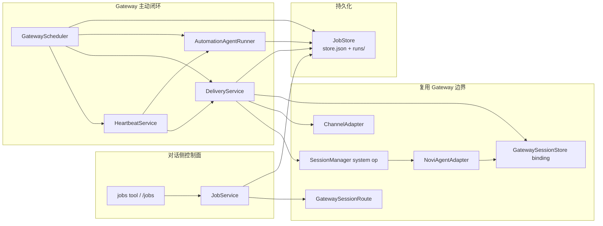
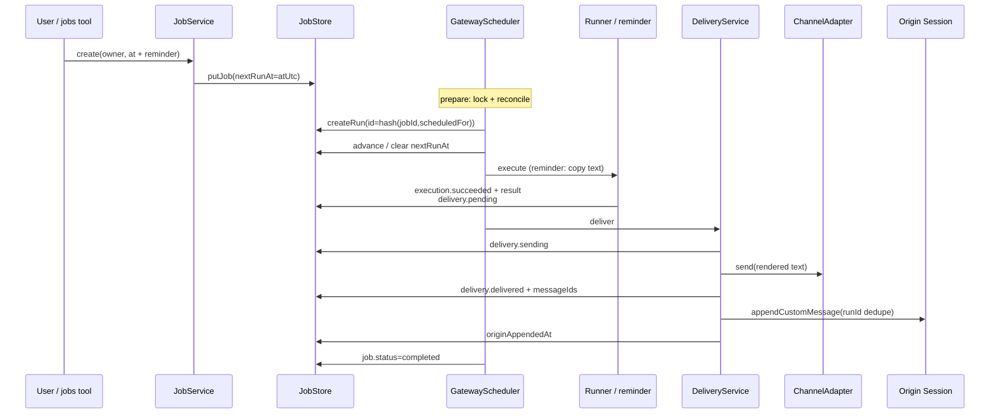

# Novi Agent 定时任务设计讲解

## 整体概览

定时任务是 Gateway 常驻进程上的**主动执行闭环**，不是独立 worker，也不是入站消息主线的一部分。入口仍是 `novi --gateway`：`runGateway` 在装配 channel、session manager 与 agent adapter 的同时，打开 `JobStore`，接线 `JobService`、`AutomationAgentRunner`、`DeliveryService`、`HeartbeatService` 与 `GatewayScheduler`。用户或 agent 通过对话内 `jobs` 工具 / `/jobs` 命令写入 durable 定义后，由 scheduler 在进程内 claim、执行、投递，再可选地把结果追加回 origin session。

它在系统中的位置可以一句话概括：**入站主线处理“别人找 agent”；jobs 主线处理“agent / 系统按约定主动找人”。** 二者共用 route、session binding、channel adapter 与 session lane 的 system-operation 队列，但状态机、锁、预算账本和持久化路径各自独立。`docs/gateway-design.md` 负责入站主线；本文只补主动闭环这一专章。

最重要的设计思想有三条：

1. **持久化状态是权威，内存定时器只是唤醒手段。** 到期时刻写在 `ScheduledJob.nextRunAt`；occurrence 以 `jobId + scheduledFor` 派生确定性 run id 独占 claim。
2. **执行与投递状态机分离。** 模型/提醒结果先有界落盘，再按同一份字节做至少一次 channel 投递；投递失败不得重新跑 agent。
3. **无人值守默认收紧。** 自动化 harness 固定模型、切断 fallback / MCP / Skills / 用户 hooks，工具集合只能是 unattended allowlist 的子集；Heartbeat 是同一执行/投递管道上的合成低频任务，而不是第二条并行产品线。



---

## 要解决的问题

若把“提醒我明天开会”“每天巡检仓库并通知”做成普通对话回复，会立刻撞上 Gateway 的生命周期与安全约束。

### 1. 主动能力需要跨重启

Gateway 进程会重启；IM 连接会抖动。提醒与 cron 不能只活在 `setTimeout` 里。定义、下次触发时刻、某次 occurrence 的执行进度与投递进度，都必须落在 `$NOVI_HOME/jobs` 下可恢复的文件状态中。

### 2. 入站主线不能承载“无人值守”

入站 harness 绑定某个 chat 的对话历史，可访问较完整的工具与（在授权后）MCP。定时任务经常在用户不在场时触发：它必须用**隔离 session**、**固定模型**、**收紧工具**，并且不能因为一次自动化 prompt 再创建更多 job，形成自增殖。

### 3. 执行与通知失败模式不同

LLM 超时、预算耗尽、模型不可用，与 Telegram 发送失败、session 忙碌导致 origin append 失败，是两类问题。把它们揉成一个“run 失败就整体重来”，要么重复收费，要么丢失已生成结果。系统需要**先固定结果，再重试投递**。

### 4. 漏跑语义必须可预测

进程停机期间，one-shot 提醒过期与 cron 过期的产品含义不同：前者用户仍想收到“迟到的提醒”；后者补跑所有错过的 slot 会制造风暴。重启恢复还要处理半截 `running` 执行与半截 `sending` 投递，且不能把同一 occurrence claim 两次。

### 5. 所有权与目标授权

谁创建的 job，就应只能由同一 `channel/account/chat/thread` route 查看与变更。跨对话投递不能“随手写一个 chat id”，而必须绑定已存在的 durable session binding，避免越权推送。

---

## 核心抽象

### `ScheduledJob`：长期定义

`ScheduledJob`（`src/gateway/jobs/types.ts`）是用户可见的 durable 定义：

- **身份与所有权**：`id`、`name`、`owner: GatewaySessionRoute`
- **生命周期**：`status` 为 `enabled | paused | completed | cancelled`
- **调度**：`schedule` + 权威游标 `nextRunAt`
- **做什么**：`payload`（`reminder` 文本，或 `agent` 的 prompt / 固定 model / tools）
- **送到哪**：`delivery`（`origin` 回创建方对话，或显式 `telegram` target）

`JobService` 在创建时施加产品约束：one-shot 只允许 reminder；cron 只允许 agent payload。这把“轻量闹钟”与“周期自动化”在类型与策略上拆开，而不是用一个万能 payload 覆盖所有情况。

### `JobSchedule`：at 与 cron

```ts
type JobSchedule =
  | { kind: "at"; atUtc: string; timezone: string; localLabel?: string }
  | { kind: "cron"; expression: string; timezone: string };
```

时刻计算集中在 `schedule.ts`：one-shot 要求带 offset 的绝对时间，或 `local + IANA timezone`；cron 固定五字段，并校验最小间隔。**权威下次运行时间写在 job 上**，不是 Croner 的内存 timer——`GatewayScheduler` 只用 `setTimeout` 逼近最近 due 点，每次 tick 仍以 store 为准。

### `ScheduledRun`：某次 occurrence 的执行与投递账本

`ScheduledRun` 记录一次触发（`scheduled | manual | recovery | heartbeat`）的全过程。关键不变量：

- `id` 对 scheduled claim 由 `scheduledRunId(jobId, scheduledFor)` 确定性派生
- `execution` 与 `delivery` **各自**有 status / attempt / maxAttempts / error
- 成功执行后的 `execution.result` 是后续投递的唯一起源；重试投递复用同一字符串

执行状态大致覆盖 `queued → running → succeeded|failed|interrupted|skipped`；投递状态覆盖 `not_required → pending → sending → delivered|suppressed|delivery_failed`。`originAppendedAt` 把“频道已发出”和“来源 session 已写入”再拆一层。

### `JobStore`：严格 JSON 持久化与独占 claim

`JobStore` 根目录默认 `~/.novi/jobs`（由 `getNoviDir()` 决定，测试中可替换）：

| 路径 | 内容 |
|------|------|
| `store.json` | 全部 job 定义、日预算、Heartbeat task 状态 |
| `runs/<jobId>/<runId>.json` | 单次 run 的版本化记录 |
| `scheduler.lock` | 单进程 scheduler 所有权 |

`store.json` 与既有 run 的更新走 temp+rename（`atomicWrite`）；**首次** `createRun` 用 `O_EXCL`（`open(..., "wx")`）保证同 id 只创建一次——第二次返回已有记录且 `created: false`。未知/损坏版本 fail-closed，**不覆盖坏文件**，避免静默丢状态。进程内 mutation 串行化，降低并发写交错。

### `JobService`：生命周期与 route 隔离

`JobService` 是控制面：create / list / get / pause / resume / cancel / runNow / retryDelivery。所有变更入口先 `owned(owner, id)`，按 `owner.key` 隔离；跨 route 一律表现为 not found。创建时还会：

- 解析并校验 schedule / model auth / tools ⊆ `automation.allowedTools`
- 显式 Telegram target 必须已有 durable binding
- `runNow` 用随机 id 建 `manual` run（不与 scheduled occurrence id 冲突）
- `retryDelivery` 要求已有 `execution.status === "succeeded"` 且存在 `result`

对话侧 `jobs` 工具与 `/jobs` slash command 都只是它的薄封装；变更后通过 `kick()` 唤醒 scheduler。

### `GatewayScheduler`：claim、reconcile、dispatch

`GatewayScheduler` 是主动闭环的协调器。`runGateway` 中的装配顺序是源码事实：先 `scheduler.prepare()`，再 `app.start()`（channel 就绪），最后 `scheduler.start()` 进入 dispatch。

1. **`prepare()`**：拿 `SchedulerLock` → retention cleanup → `reconcile()`；失败必须释放锁。`start()` 在锁已持有时是幂等的，不会重复抢锁。
2. **`start()`**：在 prepare 成功后把 `stopped` 置 false 并立刻 `tick()`；产品意图是“channel 就绪后再外发”，由 `runGateway` 的调用次序保证，而不是 `start()` 内部再检查 adapter。
3. **`tick()`**：due claim → 执行 queued/interrupted → 到期投递 / origin append → one-shot 完成后标记 `completed` → 可选 Heartbeat → 计算下次 sleep

类注释写得很直接：*Store state, never in-memory timers, is authoritative.*

### `AutomationAgentRunner`：隔离的无人值守 harness

对 `payload.kind === "agent"`，runner 每次：

1. 检查日 token / cost 预算；超限则 `skipped`，告警投递至多一天一次
2. 校验 pinned model 仍可用且已认证——**从不 fallback**
3. 将 run 标为 `running` 并递增 attempt
4. `createHarnessForSession({ kind: "new" }, …)`：空 skills/templates、`connectMcp: false`、`registerUserHooks: false`、`activeToolAllowlist: job.payload.tools`
5. 超时 abort；结果 UTF-8 有界截断后写入 `execution.result`，delivery 置 `pending` 或静默 `suppressed`
6. finally：关闭 harness/MCP，并删除这次临时 JSONL session——自动化**不**污染用户对话历史

### `DeliveryService`：至少一次外发 + 可重试 origin 追加

投递读的是已持久化 result（或失败/跳过时的错误文案），组装 `[Novi job <name> · <short ids>]` 头。流程：

1. 校验 target 仍有 binding
2. 先落盘 `sending`，再 `channel.send`
3. 成功后写 `delivered` + `messageIds`，若 target 等于 owner，再走 origin append
4. append 走 `sessionManager.enqueueSystemOperation` → `agent.appendScheduledDelivery`；`details.runId` 是 session 内去重键
5. append 失败时**保持 delivered**，只安排 append 重试——不会再发 Telegram

### `HeartbeatService`：合成低频检查

Heartbeat **不**写入用户可见的 job 定义表项，而是每次 tick 构造 id 为 `heartbeat-gateway` 的合成 `ScheduledJob`，复用 runner / delivery / run 目录。它从 `HEARTBEAT.md` 解析任务列表，用 fingerprint + `everyMs` 判断 due，并受 active hours、静默标记与全局自动化预算约束。下文把它当作次要关键设计点，而不是第二条完整主路径。

---

## 运行机制：一次 occurrence 怎么走完

代表性主路径以 **one-shot reminder** 最清晰；agent cron 在“执行”阶段换成 runner，前后骨架相同。



### 1. 创建

用户在某条 Telegram 对话里让 agent 调 `jobs`，或直接 `/jobs`。`JobService.create` 把当前 session 的 `GatewaySessionRoute` 写成 owner，计算 `nextRunAt`，`putJob` 进 `store.json`。命令/工具随后 `kick()` scheduler，避免干等到下一次轮询。

### 2. Claim

`tick` 发现 `status === "enabled"` 且 `nextRunAt <= now`：

1. `scheduledFor = nextRunAt`
2. `id = scheduledRunId(jobId, scheduledFor)`（sha256 前 32 hex）
3. `createRun(makeRun(...))`——已存在则不是新 occurrence
4. 推进游标：cron 写**从 now 起**的下一 future occurrence；at 置 `nextRunAt = null`

因此“同一 occurrence 不重复 claim”是文件系统独占创建保证的，不是靠内存 set。

### 3. 执行并持久化结果

- **reminder**：不经模型，直接把 `payload.text` 写入 `execution.result`，`delivery = pending`
- **agent**：`AutomationAgentRunner.execute`；成功后 result 有界落盘，再把 delivery 设为 `pending`（`SILENT` 类标记则 `suppressed`）
- 可重试失败时 scheduler 在同一 run 上循环 attempt，**不**新建另一个 scheduledFor

执行阶段结束时，occurrence 的“说了什么”已经固定。后面所有投递重试都读这份字节。

### 4. 投递

`DeliveryService.deliver` 在 `pending` 时发送 channel 消息。渲染层读的是已落盘的 `execution.result`（失败/跳过时则用 `execution.error` 文案），并可能给迟到的 one-shot 加 `Delayed reminder (originally …)` 前缀，但**不改变**已存 result。发送前写 `sending`，是为了崩溃恢复时知道“可能已经到了用户手机上”。

### 5. Origin session 追加

对 `delivery.kind === "origin"`（或显式 target 恰等于 owner）在 channel 成功后追加自定义消息：

- 文案带 system-generated / untrusted 声明，明确**不授予新权限**
- 通过 session lane 的 system operation 串行，避免与用户 turn 打架
- `runId` 去重：重复 append 是 no-op
- 不进入入站 pipeline，因此不会再次触发 agent

### 6. One-shot 收尾

当 at-job 的 delivery 已 `delivered`，且不需要 append 或 append 已完成，scheduler 把 job 标为 `completed` 并清空 `nextRunAt`。cron 则保持 `enabled`，等待游标上下一次。

---

## 关键设计

### 1. 执行状态与投递状态分离

这是整条主动闭环的脊梁。

若合成一个状态，常见错误是：Telegram 失败后重新 `harness.prompt`，费用加倍且结果漂移；或 channel 已成功但本地还没记上，重启后再生成一条不同文案。当前模型强制：

| 阶段 | 权威数据 | 重试含义 |
|------|----------|----------|
| execution | `result` / `error` / attempt | 同一 run 上有限次重试；不新建 occurrence |
| delivery | 渲染自已存 result；`messageIds` / ambiguity 标志 | 只重发**同一**文案 |
| origin append | `originAppendedAt` + session `runId` | 只补本地历史，不重发 channel |

契约层与测试都锁死了“成功结果先落盘，再 deliver”的顺序。`retry_delivery` 控制面入口同样要求成功 result 已存在。

代价是状态空间变大，观察一次 run 要同时看两个子对象；换来的是费用可预期与投递可恢复。

### 2. 确定性 occurrence claim

`scheduledRunId(jobId, scheduledFor)` + `createRun` 的 `wx` 创建，保证：

- 调度器重复 tick、崩溃后再次看到同一 `nextRunAt`、并发逻辑失误，都不会长出第二个同 occurrence 文件
- 执行重试只递增 `execution.attempt`，id 不变
- `manual` / `heartbeat` 使用 uuid，与 scheduled 命名空间分离

配合 claim 后立刻改写 `nextRunAt`，cron 不会在同一 wall-clock slot 上被反复 claim。**权威游标在 job 上，权威 occurrence 在 run 文件上**，两者一起构成“至少创建一次、至多一个 id”的骨架。

### 3. 漏跑与重启恢复语义

`reconcile()` 在 channel 启动前运行，行为由源码与测试明确固定：

| 场景 | 行为 |
|------|------|
| 过期 **one-shot** | 不改写历史 `nextRunAt`；正常 claim 一次；投递文案可标 Delayed |
| 过期 **cron** | **no catch-up**：把 `nextRunAt` 推到 now 之后的下一 occurrence，不补跑中间 slot |
| run.`execution.status === "running"` | 标为 `interrupted`（仍有 attempt）或 `failed`；后续同 run 重试 |
| run.`delivery.status === "sending"` | 回到 `pending`，置 `deliveryAmbiguous` + `possibleDuplicate`，再 send |
| 已 `delivered` 但缺 `originAppendedAt` | 只重试 append |

从实现与契约测试看，这组语义更可理解为：提醒“晚到也有用”；周期任务“漏了就漏了，避免雪崩”；外发“宁可可能重复，不可假装一定没发出”。Telegram 侧因此是**至少一次**；origin session 侧靠 `details.runId` 做成**恰好一次追加**（adapter 在 `appendCustomMessageEntry` 前按 branch 去重）。

### 4. Route 所有权与无人值守边界

**所有权**：job 的 canonical owner 是创建时的 route。list/get/mutate 全部按 `owner.key` 过滤；显式跨 chat 投递不改变 owner，且 target 必须已有 `GatewaySessionStore` binding——没有“随便填 chat id 推一把”的旁路。

**控制面可见性**：`jobs` 工具只挂在 Gateway 对话 harness（`NoviAgentAdapter` 注入 descriptor），modes 为 `gateway`；自动化 runner 的 system prompt 明确要求不要创建 schedule，且 active tools 来自 job 自己的 allowlist 子集，默认配置是只读/检索类工具，不包含 `jobs` / shell / write。

**执行面收紧**（`agent-runner.ts` + `createHarnessForSession` 选项）：

- model 钉死在 payload；缺失或未认证直接失败
- 无 MCP、无用户 hooks、无 skills/templates
- 日预算超限 skip，告警最多一天一次
- 临时 session 用完即删，避免与用户上下文串味

项目层 automation 配置在 gateway config 合并规则里是 tighten-only：可以再砍工具或降预算，不能放宽全局 unattended 权威。这与工具系统“project 不可放宽权限”的总原则一致。

### 5. Heartbeat：合成任务上的成本与噪音治理

Heartbeat 回答的是另一个问题：在**不**为每条检查建用户 job 的前提下，让 Gateway 按 `HEARTBEAT.md` 做低频巡检。

关键机制（均次于 reminder/cron 主路径理解）：

1. **合成 job**：固定 `jobId = "heartbeat-gateway"`，不进 `store.jobs`；run 仍落在 `runs/heartbeat-gateway/`，因此 retention 照样清理
2. **due 计算**：解析 frontmatter tasks 或整篇文档；`fingerprint` 变化或超过 `everyMs` 才执行；无内容 / 无 due → **不调模型**
3. **active hours**：配置窗口外直接 return
4. **静默**：Heartbeat 用自己的标记集（`HEARTBEAT_OK` / `SILENT` / `[SILENT]` / `NO_REPLY` / `NO REPLY`）把结果标为 `suppressed`；普通 agent job 则走共享的 `isSilentReply`（`silent` / `[silent]` / `no_reply` / `no reply`）。二者不完全相同，但目标一致：避免“没事也刷屏”
5. **单飞恢复**：若已有未完成 heartbeat run，优先推进该 run，而不是无限堆积新 occurrence
6. **预算与工具**：走同一 `AutomationAgentRunner` 与 `allowedTools`，共享日限额

它证明了主动闭环的抽象足够：不必为“系统级巡检”再做一套 runner。代价是合成 job 与用户 job 混用 run 目录约定，阅读代码时要意识到 `store.jobs` 里可能看不到 heartbeat 定义。

---

## 异常与边界

### 调度与存储

- **另一活着的 scheduler lock owner**：启动失败，避免双写 claim
- **损坏的 store/run 版本**：读失败并保留原文件；不会“修复性”覆盖
- **job 在 queued/interrupted 期间被 cancel/complete**：execution 标 `skipped`，delivery `suppressed`
- **retention**：终端态 job 与过期 run 按天/每 job 上限清理；进行中的 execution/delivery 不删；无定义的 heartbeat run 目录同样适用

### 时刻语义

- cron 必须五字段；秒级表达式拒绝
- 最小间隔由 `automation.minCronIntervalMs` 约束（默认 5 分钟量级）
- DST gap：不存在的本地 wall-clock 被 skip；Croner 前移候选后，Novi 用 `CronPattern` 复核 hour/minute，不匹配则再取下一次
- one-shot 创建时必须严格未来；到期后的 catch-up 是 scheduler 行为，不是创建校验

### 执行

- pinned model 不可用 → fail，无 fallback
- 超时 → abort harness，记失败并可按 retryable 重试
- 预算耗尽 → `skipped`；若需通知则 delivery pending 一次告警文案
- 静默标记 → `delivery.suppressed`（agent 用 `isSilentReply`；Heartbeat 另含 `HEARTBEAT_OK` 等）

### 投递

- binding 撤销/缺失 → `TARGET_UNAUTHORIZED`，不可改道任意 id
- channel 暂不可用 → 有限次指数退避，直至 `delivery_failed`
- `sending` 崩溃恢复 → 明确可能重复
- origin append 失败 → 保持 channel delivered，仅重试 append

### 与入站主线的边界

Jobs **复用** route key、session binding、channel `send`、session manager 的 system operation、adapter 的 `appendScheduledDelivery`。Jobs **不**走 `GatewayApp` 入站 dedupe/配对/queue mode，也不把 scheduled 输出再喂回入站 agent 循环。理解 Gateway 时，应把 jobs 看成挂在同一进程上的第二条闭环，而不是 `onMessage` 的一个分支。

---

## 设计权衡

### 收益

1. **可恢复的主动能力**：定义、occurrence、结果、投递进度都 durable，进程重启后行为可解释。
2. **费用与副作用可控**：执行/投递分离 + 确定性 claim + 日预算 + unattended allowlist，限制了自动化最危险的三种失控（重复计费、重复 claim、工具面过宽）。
3. **与 Gateway 其余部分松耦合**：控制面经 `JobService`，执行面经独立 harness，投递面经已有 channel/session 边界；入站文档可以只一笔带过。
4. **语义清晰的漏跑策略**：one-shot 补一次、cron 不追赶，比“一律补跑”或“一律丢弃”更符合 IM 场景。

### 成本

1. **双状态机认知负担**：排障要同时看 execution 与 delivery，还要看 originAppendedAt 与 ambiguity 标志。
2. **至少一次投递的用户可见重复**：在 `sending` 崩溃窗口，用户可能收到两条相同 job 头消息；系统选择诚实标记 possible duplicate，而不是假装 exactly-once。
3. **单进程锁**：水平扩展多个 gateway worker 同写一份 jobs 目录不被支持；简化了 claim，也限制了部署形态。
4. **Heartbeat 合成路径的隐式约定**：固定 job id、文档约定、静默词表，对不读源码的运营者不够“自解释”，需要配置与文档配合。

### 适用范围

适合：单机（或单活）Gateway、Telegram 等已接 channel、需要跨重启的提醒与低频自动化、可接受至少一次通知。

不适合（至少不是当前实现目标）：多活调度集群、强 exactly-once 外发、让无人值守 cron 自动获得 shell/写盘/MCP 的高权限运维机器人、把 jobs 当作通用分布式任务队列。

### 实现选择 vs 业务必然

下列更多是当前工程选择，而不是 IM agent 的唯一答案：

- 文件 JSON 而非 SQLite/外部队列
- reminder/at 与 agent/cron 的配对限制
- cron no-catch-up（可改成有界 catch-up，但会引入风暴治理）
- Heartbeat 复用 run 管道而非独立子系统

在源码未写明处，不应把这些上升成不可变产品公理。契约文件 `.trellis/spec/backend/scheduled-jobs.md` 固化的是**现行**安全与恢复边界；若实现演进，应以源码与测试为准更新专章。

### 源码事实 / 合理推断 / 未知

- **源码事实**：`ScheduledJob` / `ScheduledRun` 字段与双状态机、`scheduledRunId` + `createRun("wx")` 独占 claim、`reconcile` 对 cron 过期 / `running` / `sending` 的处理、`JobService` 的 at=reminder 与 cron=agent 约束、route 所有权与 binding 校验、执行结果先落盘再 `DeliveryService.deliver`、origin append 的 `runId` 去重、`AutomationAgentRunner` 的固定模型与收紧 harness、Heartbeat 合成 `heartbeat-gateway` 与静默/active hours/预算，均可在 `src/gateway/jobs/**`、`src/gateway/run.ts`、`src/gateway/agent/novi-agent-adapter.ts` 与对应测试中直接对应。
- **合理推断**：把“执行/投递分离 + 确定性 occurrence + unattended 收紧”写成三条主线，是从状态机与失败路径归纳出的阅读模型，而不是仓库里某份 ADR 的原文。漏跑策略的产品含义（晚到提醒有用、cron 不追赶、sending 允许重复）是从行为与契约反推的解释。
- **未知 / 未在本文展开**：完整 `gateway.json` 字段手册、每个 `/jobs` 子命令与 tool 参数矩阵、Telegram 以外 channel 的投递差异、多活/分布式调度是否会引入外部锁或队列——当前实现与测试只覆盖单进程文件 store。历史任务 `archive/.../07-14-proactive-scheduled-jobs/` 可作意图背景，**不能**单独证明现行行为。

---

## 小结

Novi 的 agent 定时任务，是 Gateway 长生命周期进程上长出的主动触角：`JobStore` 保存真相，`JobService` 按 route 管理定义，`GatewayScheduler` 负责 claim 与推进，`AutomationAgentRunner` 在收紧沙箱里产出有界结果，`DeliveryService` 把同一结果至少一次送到 channel 并恰好一次（按 runId）写回 origin session。Heartbeat 只是这条管道上的合成低频客户端。

抓住三条主线即可建立心智模型：

1. **定义与 occurrence 分离，occurrence id 由 jobId+scheduledFor 钉死**
2. **先固定执行结果，再独立重试投递与 origin 追加**
3. **无人值守默认少权力、少噪音、可恢复，而不是“后台再跑一个完整 agent”**

入站消息如何变成对话，见 `docs/gateway-design.md`；工具与权限总则见 `docs/tool-system-design.md`。本文不再展开那些主线。
