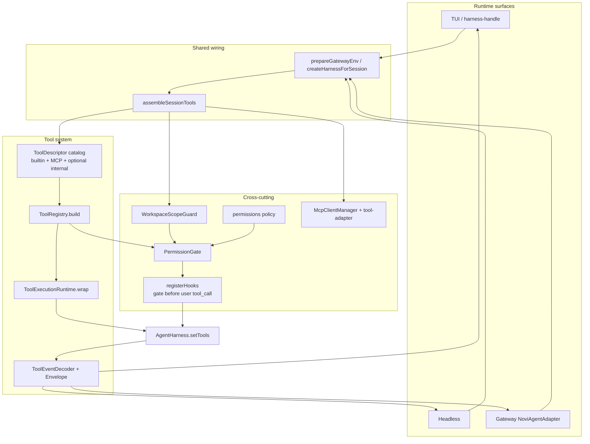
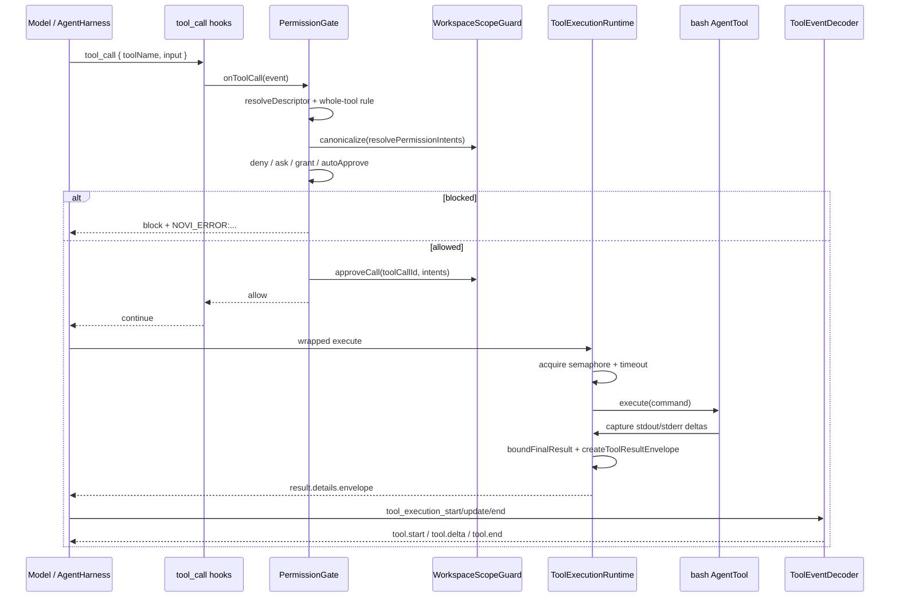

# Novi Agent 工具系统设计讲解

## 整体概览

工具系统是 Novi 把「模型可调用的能力」统一成可装配、可治理、可观测执行面的那一层。它不负责对话编排或模型协议本身——那些属于 `@earendil-works/pi-agent-core` 的 `AgentHarness`——而是站在 harness 与真实副作用之间：决定哪些工具对当前会话可见，如何把一次调用约束在预算与权限内，以及如何把结果投影成三套运行表面都能理解的事件。

在系统位置上，它属于共享核心，而不是某个 UI 的私有逻辑。源码主锚点是 `src/tools/**`（契约、注册表、装配、内置工具、执行运行时、事件），横切依赖 `src/permissions/**` 与 `src/mcp/**`；TUI、Headless、Gateway 只在装配入口拿到 `ToolAssembly` / `toolCatalog`，再通过统一的 `ToolEventDecoder` 消费执行生命周期。`ARCHITECTURE.md` 把这条路径概括为：Descriptor → Registry → Assembly → Runtime wrap → PermissionGate → Events。

最重要的设计思想可以压成三句话：

1. **工具身份是 descriptor，不是散落的 `if (name === ...)`。** 权限、曝光、展示、MCP 适配都围绕同一份元数据。
2. **可见性与执行许可分离。** active set 决定模型能不能“看到/点名”某个工具；`PermissionGate` 再按本次 input 的 capability + scope 做 deny-first 决策。
3. **执行结果只有一个公共形状。** `ToolExecutionRuntime` 把输出收成有界 envelope，`ToolEventDecoder` 是三表面唯一的 tool payload 解释权。

---

## 要解决的问题

若把 agent 工具做成「每个工具一个函数，谁需要谁 import」，很快会碰到几类互相缠绕的约束。

### 1. 多来源、同一执行面

内置工具是代码拥有的稳定能力（读文件、bash、搜索等）；外部工具来自 MCP server，名字、schema、风险都不可事先写死；Gateway 还可能注入仅在该表面存在的内部工具（如 `jobs`）。调用方——harness、权限门、TUI 列表、Headless JSON——不应各自维护一套“这是什么工具”的分支。

### 2. 三种运行表面、一套策略

TUI 可以弹审批；Headless 与 Gateway 基本是非交互 fail-closed（可用 `--yes` 把 ask 放宽为 allow）。工具还必须能按 mode 暴露：例如 `jobs` 只声明 `modes: ["gateway"]`。如果每个表面各写一套 enable/disable 逻辑，策略会漂移。

### 3. 模型上下文与进程资源都是有限的

bash 或 grep 可能吐出数兆字节；并发工具调用会抢 CPU/IO；artifact 与 web cache 会落盘。领域工具自己发明超时、截断和“把完整 stdout 塞进 details”会导致上下文爆炸与内存失控。需要**会话级**的统一 runtime 拥有这些边界。

### 4. 安全边界不能靠工具名字符串

“允许 bash”不等于允许任意路径写文件；“允许 read_file”也不该因为一次 session grant 就覆盖新的 deny 规则。策略必须以 **capability + 规范化 target/scope** 表达，并且对 workspace 内外路径、符号链接重定向有明确语义。同时系统明确**不是 OS 沙箱**：`bash` 审批通过后仍受操作系统自身权限约束。

### 5. 可观测性要跨表面一致

TUI 要 live 状态与 resume；Headless JSON 要稳定 JSONL；Gateway channel 要回调而不理解 harness 原始事件。若各表面解析 `tool_execution_*` 的方式不同，错误码、截断信息与展示会分叉。

简单实现不够，是因为上述问题共享同一批对象（工具身份、active set、权限决策、结果 envelope）。工具系统正是把这些对象提成一层契约，而不是在每个工具或每个表面重复。

---

## 核心抽象

### ToolDescriptor：代码拥有的工具身份

`src/tools/contracts.ts` 中的 `ToolDescriptor` 描述“工具是什么”，而不是某次调用发生了什么。关键字段包括：

| 字段                                            | 作用                                                                                     |
| ----------------------------------------------- | ---------------------------------------------------------------------------------------- |
| `name` / `label`                                | 稳定工具名（registry 校验）与展示标签                                                    |
| `source`                                        | `{ kind: "builtin" \| "external", id }`，用于 source 级开关与诊断                        |
| `capabilities`                                  | 策略词表（如 `filesystem.read`、`shell.execute`、`external.invoke`），**不是**工具名本身 |
| `risk` / `defaultPermission` / `defaultEnabled` | 风险档、默认审批级别、默认是否启用                                                       |
| `streaming` / `modes`                           | 是否 delta 流式、在哪些 runtime mode 可用                                                |
| `optional`                                      | 工厂/依赖失败时 fail-soft，不拖垮整次装配                                                |
| `factory`                                       | 给定 `ToolFactoryContext` 产出 pi 的 `AgentTool`                                         |
| `resolvePermissionIntents`                      | 从本次 input 抽出最小权限意图                                                            |

可序列化投影 `SerializableToolDescriptor` 去掉 factory/resolver，供 catalog、TUI、Headless 携带。能力词表 `TOOL_CAPABILITIES` 是权限规则与 MCP 粗映射的公共词汇；工具名则更偏呈现与调用入口。

### ToolRegistry：校验与 active set 的唯一所有者

`ToolRegistry`（`src/tools/registry.ts`）负责：

1. 注册时校验名字、元数据、capabilities、modes、factory/resolver 形态；
2. 拒绝重复名与非法 schema；
3. 在 `build()` 中按 **source 开关 → mode → tool enabled → factory → whole-tool permission** 顺序计算每个工具的 `ToolAvailability`，并产出 `tools` / `activeToolNames`。

前几步失败（source/mode/settings 关闭，或 optional 工厂抛错）时工具根本不会进入 `tools` 数组。只有工厂已成功、却被 whole-tool `deny` 挡住的工具会仍留在 `tools` 里、却不进 `activeToolNames`——模型侧不可见；若出现 stale call，`PermissionGate` 会以 `TOOL_DISABLED` 拦截。optional 初始化失败记为 `unavailable` + diagnostic，其余工具继续装配。

### ToolAssembly：一次会话拿到的完整工具包

`ToolAssembly` 是装配结果的统一载体：已包装的 `AgentTool[]`、可序列化 descriptors、active 名列表、availability、diagnostics、与权限门共享的 `WorkspaceScopeGuard`，以及 `resolveDescriptor(name)` 供 gate 在调用时找回完整 descriptor（含 intent resolver）。

两条入口：

- **同步** `createBuiltinToolAssembly`：仅内置（+ 可选 `additionalDescriptors`）；
- **异步** `createToolAssembly` / `assembleSessionTools`：内置 + 可选 MCP plan；后者是 bootstrap / resume / gateway / TUI rebuild 的共享会话入口。

装配时会创建**一个** `ToolExecutionRuntime` 与**一个** `scopeGuard`，再对每个 tool 做 `runtime.wrap`——横切治理不落在领域工具内部。

### ToolExecutionRuntime：会话级资源与结果治理

`ToolExecutionRuntime`（`src/tools/runtime/runtime.ts`）拥有：

- 每会话并发信号量（默认 `maxConcurrentCalls: 4`）；
- 硬超时（默认 120s，含排队等待）；
- partial update 的 sequence 与文本有界；
- 最终结果的 model-facing 截断、details 内存上限；
- 溢出时的 artifact 落盘（`ArtifactStore`）；
- 稳定错误前缀 `NOVI_ERROR:<code>:<message>`。

预算由 `resolveToolExecutionBudget` 解析：默认 ← global（可松可紧）← project（**只能收紧**）← CLI（可松可紧；非法/冲突值 fail startup）。artifacts 开关同样对 project 只允许关不允许开。领域工具若已自行标记 `resourceGoverned`（如 bash / `read_file` 使用 `createCapture`），runtime 尊重其 metrics，避免二次全量缓冲；否则对最终文本再包一层 capture。

### Permission 子系统：策略、门、作用域

权限不是“工具名 → allow/deny”的扁平 map，而是：

1. **`ResolvedPermissions`**：全局规则 + 项目只收紧规则 + 全局 `externalWriteAllowlist` + `--yes` 的 `autoApproveAsks`；
2. **`PermissionGate`**：在 `tool_call` hook 上 deny-first 评估；
3. **`WorkspaceScopeGuard`**：把 raw intent 规范成 lexical/effective 路径对、域名、精确命令等；并在 native I/O 前 `assertNativeFileAccess` 防 symlink 重定向；
4. **`SessionPermissionStore`**：进程内存中的最小 scope grant（不跨进程持久化）。

决策优先级是 **deny > ask > allow > descriptor default**。只有无 target/scope 的“整规则”影响 descriptor 是否进入 active set；带 scope 的 deny 保持工具可见，但在调用时拦截。

### MCP 适配：外部工具变成同一类 descriptor

`McpClientManager` 管理 server 连接、完整分页 catalog 与 `callTool`；`adaptMcpTools` 把 MCP `Tool` 变成 `source.kind === "external"` 的 `ToolDescriptor`：

- 稳定命名 `mcp_<server>_<tool>`（碰撞追加 `_2`…）；
- 默认 `defaultPermission: "ask"`、`optional: true`；
- capabilities 由 annotations/参数名**粗映射**，映射不出时退回 `external.invoke`；
- 小 catalog 可直接暴露，大 catalog 走 `mcp_tool_search` / `mcp_tool_invoke`，opaque `toolRef` 绑定 catalog/tool revision；
- factory 内部调用 manager，并由 `result-mapper.ts` 统一保留 text/image、结构化输出、resource link/embedded resource；audio/blob 与超预算图片只进入私有 binary artifact；
- progress 使用同一 AbortSignal 与硬总超时，经过单调校验、限频和 true-delta 映射；
- 错误区分 `MCP_TOOL_ERROR`、input/output schema、protocol、transport、stale、timeout 与 abort，而不是折叠成一个通用执行错误。

MCP plan 有 connectable / pending / denied / invalid 等状态；preflight 可 `connectMcp: false` 只收集诊断而不 spawn。连接失败 fail-soft，不拆除 builtin。**Project trust 不等于 MCP approval**——这是配置层的独立决策，装配路径会尊重 plan 状态。

Novi 当前采用 Tools-first 支持边界：支持 tools discovery/call/progress/cancellation；resource link 与 embedded text 只保留语义而不隐式读取；audio/blob 降级为私有制品。Remote HTTP 支持 challenge-driven OAuth，但这只解决 transport 身份，不增加 MCP client capabilities；Resources/Prompts、Sampling、Elicitation 与 Tasks 仍不支持，client 初始化 capabilities 保持 `{}`，不会暗示存在 server-initiated handler。

### Remote MCP OAuth：独立授权边界

HTTP transport 的 OAuth 主链集中在 `src/mcp/oauth/**`，不会在 TUI、Gateway 或 tool adapter 中各保存一份 token：

1. transport 先使用静态 headers 与已有 credential snapshot；只有 Bearer 401/403 才记录 challenge。
2. manager 为一次 connect/tool operation 提供最多一次 auth recovery 与一次原操作重试。401 可 refresh 或执行配置的 `client_credentials`；403 只记录 pending scope 并返回 `MCP_AUTH_SCOPE_REQUIRED`。
3. `McpOAuthCoordinator` 是 discovery、SDK provider、loopback callback、revocation 与 store 的唯一编排边界。模型路径不会调用交互式 login。
4. TUI `/mcp login|reauthorize` 与独立 `novi mcp` CLI 才能创建 `127.0.0.1` callback 和打开浏览器；Gateway、Headless、child-agent 只消费已有 token或非交互 grant。

授权状态存入 user-local、版本化的 `McpOAuthStore`。record 绑定 declaration origin、project root、server name 与 fingerprint，并在 record 内固定 resource/issuer；fingerprint 或 issuer/resource 变化不能沿用旧 token。目录/文件模式为 `0700/0600`，更新通过同目录临时文件、sync、rename 原子发布。进程内 keyed lane、per-binding 文件 lease 与 global write lock 防止并发 refresh 覆盖轮换后的 refresh token；损坏或未知版本 fail-closed，不会按空 store 覆盖。

OAuth 网络只允许 HTTPS（随机端口的精确 `127.0.0.1` callback 是唯一 HTTP 例外），禁止 userinfo/fragment/downgrade，逐跳校验有限 redirect，限制响应大小，并要求 MCP resource 与 OAuth endpoint 使用相同的 public/private trust class。默认 Node fetch 连接到校验过的 DNS 地址，同时保留原 hostname 做 TLS 校验，避免解析后换址。metadata issuer 必须匹配发现的 authorization server，resource/issuer 已绑定后需要 `reset-auth` 才能改变。

支持 authorization code + PKCE S256、refresh rotation、预注册 client、CIMD、DCR、`client_credentials`，以及 `client_secret_basic`、`client_secret_post`、public `none`。PRM 必须存在并声明 authorization server；交互登录前 metadata 必须显式声明 `code_challenge_methods_supported: ["S256"]`，不采用 SDK 的旧协议兼容回退。device flow、远程 callback relay、粘贴 code、JWT/private-key grant 和单声明多账户均不支持。`logout` 在 metadata 提供 revocation endpoint 时依次尽力撤销 refresh/access token，但无论服务端结果如何都会清理本地 token；`reset-auth` 进一步删除 discovery 与动态 registration。公共 status、diagnostic 和事件只暴露脱敏 issuer origin、resource path、scope、expiry 与稳定错误码，不暴露 token、code、verifier、client secret 或原始 OAuth response。

### 事件契约：NoviToolEvent 与 ToolResultEnvelope

`src/tools/events.ts` 定义：

- `ToolResultEnvelope`：versioned 的 success/error/cancelled + preview + metrics + truncation + artifacts；
- `NoviToolEvent`：`tool.start` / `tool.delta` / `tool.end`；
- `ToolEventDecoder`：从 harness 的 `tool_execution_*` 解码；
- `reduceToolCallState`：把事件折成 `ToolCallView[]`（TUI live/resume 共用）。

公共边界强制 JSON-safe：拒绝函数、循环、非有限数、密钥类字段名。decoder 是跨表面**唯一**解释权；各表面只做投影（TUI 渲染、Headless JSONL、Gateway `onToolEvent`）。

---

## 整体机制

### 组件关系

### 发现 → 装配 → 暴露 → 执行 → 事件

端到端主路径如下（与 `bootstrap` / `createHarnessForSession` 一致）：

1. **准备环境**：`prepareGatewayEnv` 解析 settings、permissions、tool budget；对工具做一次 `connectMcp: false` 的 preflight，只为 diagnostics / 早期 catalog，不拉起 MCP 进程。
2. **会话装配**：`assembleSessionTools` 解析 MCP plan（或接受注入 plan），按需连接已批准 server，把 builtin descriptors、internal `additionalDescriptors`（如 gateway `jobs`）、MCP adapted descriptors 写入**同一个** `ToolRegistry`。
3. **算 active set**：registry 结合 `tools.enabled` / `tools.sources` / mode / whole-tool permission 得到 `activeToolNames`；工厂产出的 `AgentTool` 全部经 `runtime.wrap`。
4. **交给 harness**：`await harness.setTools(tools, activeToolNames)`——**必须显式传 active 列表**，否则新 harness 默认空 active，表现为“工具全注册却全不可用”。
5. **挂权限与 hooks**：`buildPermissionGate` 使用装配产生的 `scopeGuard` 与 `resolveDescriptor`；`registerHooks(..., { permissionGate })` 保证 `tool_call` 上 **gate 先于用户 hook**，deny sticky。
6. **模型发起调用**：harness 触发 `tool_call` hook → gate 评估 → 通过后执行 wrapped `execute` → runtime 施加超时/并发/截断 → 成功路径把 `details.envelope` 写成唯一最终 envelope。
7. **投影事件**：表面侧 `ToolEventDecoder.decode` 得到 `NoviToolEvent`；TUI 用 reducer 更新行状态，Headless 写 JSONL，Gateway 经 `createEventBridge` 调 `onToolEvent`。

### 内置与外部如何统一

统一点不是“都实现同一抽象基类”，而是**都变成 `ToolDescriptor` 再进同一 registry/runtime/gate**：

| 维度     | Builtin                               | MCP external                               | Gateway internal（例：`jobs`）                |
| -------- | ------------------------------------- | ------------------------------------------ | --------------------------------------------- |
| source   | `{ kind: "builtin", id: "builtin" }`  | `{ kind: "external", id: "mcp:<server>" }` | `{ kind: "builtin", id: "gateway-internal" }` |
| 进入方式 | `getBuiltinToolDescriptors()`         | `adaptMcpTools(manager)`                   | `additionalDescriptors`                       |
| 默认权限 | 按工具（如 bash=`ask`，read=`allow`） | 一律 `ask`                                 | 如 `allow` + `state.jobs`                     |
| 失败策略 | 非 optional 可 fail startup           | optional + server fail-soft                | 随装配注入                                    |
| 执行     | 本地 Node 实现                        | `manager.callTool`                         | 调 `JobService`                               |

对模型与 PermissionGate 而言，调用入口都是工具名 + input；差异被收进 factory 与 intent resolver。装配侧还有一个易漏细节：`ToolRegistry` 对**未声明**的 source 默认只放行 `builtin`；`buildMergedAssembly` 会在合并后把已成功适配的 MCP `source.id` 预置为 enabled（除非 `tools.sources` 显式关掉），否则外部工具会全部落在 `SOURCE_DISABLED`。

---

## 关键流程：一次工具调用

以 TUI 下模型调用 `bash` 为例（headless/gateway 的差异主要在 approver 与事件投影，主链相同）。

流程中有几处值得单独点破的语义：

**Intent 是最小授权单位。** `bash` 的 resolver 把 `command` 提成 `shell.execute` + `scope: "command"` 的精确字符串 grant，而不是“整个 bash 工具永久放行所有命令”。文件类工具提 path + file/directory/subtree；`fetch_content` 可对每个 URL 产生 domain intent。

**静态策略永远先于 session grant。** gate 先算当前 rules 的 deny/ask/allow，再看 store 是否已有匹配 grant；新 deny 不会被旧 grant 绕过。

**Native 文件有二次校验。** gate 通过后 `approveCall` 记下本次 call 的 canonical path pair；`read_file` / `write_file` / `edit_file` 在真正 I/O 前 `assertNativeFileAccess`。若 symlink 在审批后改写目标，或 external write 不在全局 allowlist，则失败关闭。`edit_file` 在读前与写前各检一次。

**Streaming 是真 delta。** runtime 给 partial 单调递增 `sequence`；decoder 产出 `tool.delta`，reducer 丢弃乱序/重复并记录诊断，而不是把累计 stdout 当更新。

---

## 关键设计

### 1. Descriptor 把“策略身份”从“执行实现”拆开

若权限与 UI 直接依赖 `AgentTool` 实例，热重载、MCP 重连、serializable catalog 都会变难。descriptor 让：

- registry 在不执行工具的情况下完成校验与 active set；
- gate 只依赖 `resolvePermissionIntents` + capabilities；
- 表面层只拿 `SerializableToolDescriptor` 做标签/风险展示。

代价是每个工具必须手写（或适配器生成）元数据与 intent resolver；MCP 侧只能做启发式 capability 映射，可能偏保守（更多 `ask` / `external.invoke`）。

### 2. Exposure 与 Permission 两层门

**Exposure**（settings `tools.enabled` / `tools.sources`、mode、whole deny、unavailable）回答：模型的工具列表里有没有这个名字。  
**Permission** 回答：这一次参数允不允许做。

这样可以表达“grep 始终可见，但某 subtree deny”“bash 可见但每条命令 ask”“MCP server 整源关掉”等策略，而不把 scoped deny 误做成从模型视野中删除工具（否则模型会反复“发明”已隐藏能力或无法解释失败）。stale call 仍可能打到已构建的 tool 对象，gate/runtime 用 `TOOL_DISABLED` 等码兜住。

### 3. 统一 Runtime 包装，而不是每个工具自建预算

`runtime.wrap` 把超时、并发、最终 envelope 设为默认；高产出工具再主动用 `createCapture` / `DeltaLimiter` 做流式有界捕获。预算解析对 project 层 **tighten-only**，避免不可信项目配置把全局护栏拧松。

这与“工具自己 `stdout += chunk` 并回传全量 details”的做法相反：公共 details 最终收敛为 envelope，完整输出在需要时进 `~/.novi/artifacts/<session>/<call>/`，而不是重复进模型上下文。

### 4. PermissionGate 与用户 hooks 显式 compose

core 的 `emitHook` 是 last-non-undefined-wins。若只靠注册顺序让 gate 与用户脚本竞争，用户 hook 可能“放行”已 deny 的调用。Novi 在 `registerHooks` 里用 `makeComposedToolCallDispatcher`：**先 gate，deny 则跳过用户 hook；allow 后用户仍可 block**。即使没有任何用户 `tool_call` hook，也会注册仅含 gate 的 dispatcher。

### 5. 单一事件解码器作为跨表面协议

Headless 打破旧字段、只发 `tool.start|delta|end`；TUI 与 Gateway 复用同一 decoder/envelope。这强制：

- 成功路径 runtime 写入可校验 envelope；
- 失败路径优先稳定 `NOVI_ERROR` 文本，由 decoder 重建 error envelope；
- 秘密字段与非 JSON 值不能泄漏到公共事件。

代价是演进 envelope 要当协议变更认真对待；收益是三表面不会各自发明错误映射。

---

## 异常与边界

### 装配期

| 情况                                                 | 行为                                                              |
| ---------------------------------------------------- | ----------------------------------------------------------------- |
| 重复名 / 非法 descriptor / 内置名与 tool.name 不一致 | 启动失败                                                          |
| optional 工厂失败（如 web 凭证/依赖）                | `unavailable` + diagnostic，其余继续                              |
| source/tool/mode 关闭                                | 不进 active set                                                   |
| whole-tool deny                                      | availability=`denied`，不进 active                                |
| MCP server 连接失败 / 非 connectable                 | fail-soft diagnostics；builtin 保留                               |
| MCP 名碰撞                                           | 自动后缀并记诊断                                                  |
| 非法 permission 规则                                 | 倾向 fail-closed（含 deny-all 规则 + diagnostic，见 policy 实现） |

### 调用期

| 情况                                     | 稳定码（概念）                          |
| ---------------------------------------- | --------------------------------------- |
| 未知工具 / 无 intent / capability 未声明 | `PERMISSION_INTENT_INVALID`             |
| 策略 deny                                | `PERMISSION_DENIED`                     |
| 非交互且需要 ask                         | `PERMISSION_INTERACTION_REQUIRED`       |
| 工作区外写且不在全局 allowlist           | `WORKSPACE_EXTERNAL_WRITE_DENIED`       |
| whole-tool deny 后的 stale call          | `TOOL_DISABLED`（gate）                 |
| 超时 / 调用方 abort                      | `TOOL_TIMEOUT` / `TOOL_ABORTED`         |
| 输出治理 / artifact                      | `TOOL_MEMORY_LIMIT`、`ARTIFACT_*` 等    |
| 其它执行失败                             | `TOOL_EXECUTION_FAILED`（有界单行消息） |

### 明确的非目标与外部依赖

- **不是进程级沙箱。** `bash` 注释与架构文档都写明：精确命令授权后仍是正常 OS 文件系统可达的 shell。
- **Workspace 边界 ≠ 隔离。** lexical + effective 双视图防的是路径戏法，不是 container。
- **Session grant 不落盘。** TUI 重建可复用同一 in-memory store；每个 Gateway chat 新建 store。
- **MCP capability 映射是启发式。** 从 annotations 与参数名推断；未知工具退回 `external.invoke`，因此外部工具默认更“需要确认”。
- **Web 工具**另有 SSRF/代理/缓存契约（`web_search` / `fetch_content`）：走 `guardedRequest`、批量 input、公共缓存不含凭证；本文不展开为运维手册。

### 表面差异（权限交互）

| 表面         | Approver      | 典型行为                                              |
| ------------ | ------------- | ----------------------------------------------------- |
| TUI          | `TuiApprover` | once / session / deny                                 |
| print / json | 非交互        | ask → 失败关闭                                        |
| gateway      | 非交互        | 同上；`--yes` 可使 ask 自动通过（仍先过 deny 与边界） |

---

## 设计权衡

### 收益

- **单一装配路径**（`assembleSessionTools`）服务 bootstrap、TUI rebuild、`/mcp` 刷新、Gateway 会话创建，减少“某表面漏接 MCP/预算/active 列表”的分叉。
- **策略与展示解耦**：capability 规则可跨工具复用；catalog 可序列化给 UI/JSON 而不携带函数。
- **资源与安全横切集中**：预算、artifact、envelope、gate、scope 有明确所有者，领域工具专注业务 I/O。
- **跨表面可观测一致**：同一事件 union 降低协议漂移。

### 成本

- 新工具必须补齐 descriptor 全套元数据与 intent 语义，不能只丢一个 `execute`。
- 理解调用路径需要穿过 hooks → gate → runtime → tool → decoder 多层，调试时要会读 `NOVI_ERROR` 与 availability diagnostics。
- MCP 粗映射与默认 ask 增加交互摩擦，换取不确定外部工具上的保守姿态。
- envelope/事件协议变更会影响 TUI、Headless、Gateway 三处消费者。

### 适用范围

适合：单包 agent harness、需要可配置权限与多表面一致行为、内置工具 + 可选 MCP 的产品形态。  
不太适合：期望 OS 级隔离的多租户执行、或完全动态到“无 descriptor 也能安全执行任意 RPC”的模型——当前设计故意要求进入 registry 的契约。

### 源码事实 / 推断 / 未知

- **源码事实**：上文接口名、装配顺序、gate 与 hook compose、runtime wrap、MCP 命名与默认 ask、事件 decoder 唯一性，均可在 `src/tools/**`、`src/permissions/**`、`src/mcp/**`、`src/bootstrap.ts`、`src/gateway/agent/**` 直接对应。
- **合理推断**：从结构看，descriptor 中心模型是为了同时支撑 settings exposure、权限词表、MCP 合并与三表面 catalog，而不是仅为了“多写一层类型”。
- **未知 / 未在本文展开**：各内置工具的完整参数语义与错误矩阵（见测试与 `.trellis/spec/backend/*` 契约）、MCP 运维配置细节、TUI 像素级呈现（`tool-presentation.ts` 仅为展示投影）、未来是否引入更强沙箱——现有代码未实现进程隔离。

---

## 小结

Novi 的工具系统把“模型能调用什么”收成 **descriptor 目录 + registry active set**，把“这一次能不能做、做多大、结果长什么样”收成 **PermissionGate + ToolExecutionRuntime + ToolResultEnvelope**，再通过 **ToolEventDecoder** 交给 TUI / Headless / Gateway。内置实现、MCP 适配与 Gateway 内部工具都在同一执行面上汇合；横切策略优先于工具名特例。读源码时，建议从 `contracts.ts` → `registry.ts` → `assembly.ts` → `runtime/runtime.ts` → `permissions/gate.ts` → `events.ts` 走一遍主链，再按需下沉到具体 builtin 或 `mcp/tool-adapter.ts`。
